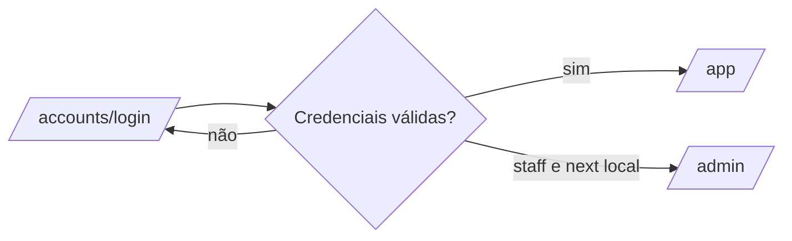

# Administração single-instance

## Escopo

O Django Admin padrão em `/admin/` é a única superfície administrativa. Ele
gerencia usuários, grupos e permissões nativas; não existe host administrativo,
Control Plane, operador de plataforma, suporte temporário ou rota `/platform/`.

## Autenticação única



`/admin/login/` redireciona para `/accounts/login/?next=/admin/`. Somente um
`next` local sob `/admin/` é preservado, impedindo redirecionamento externo. O
mesmo rate limit e a mesma política de indisponibilidade do cache protegem os
dois fluxos.

O boundary administrativo exige `is_active=True` e `is_staff=True`. A
superfície operacional exige autenticação e permissões do model; `is_staff`
sozinho não concede acesso aos módulos de `/app/`.

## Usuários e permissões

- Superusuários administram `User`, `Group` e `Permission` no Django Admin.
- Grupos devem representar papéis funcionais e segregação de funções.
- Menus usam `view`; criação usa `add`; alterações e ações de detalhe usam
  `change`; exclusão usa `delete`.
- A trilha nativa do Admin complementa as trilhas funcionais dos domínios, sem
  substituí-las.

O administrador inicial aprovado para a instalação é
`Rui <ruign2015@gmail.com>`. A senha deve ser definida por canal operacional
fora do Git, com entrada não exibida e validação posterior por `check_password`.

## Verificação

```bash
./scripts/test.sh tests/test_single_instance_admin_runtime.py \
  tests/test_single_instance_auth_access.py -q
```
