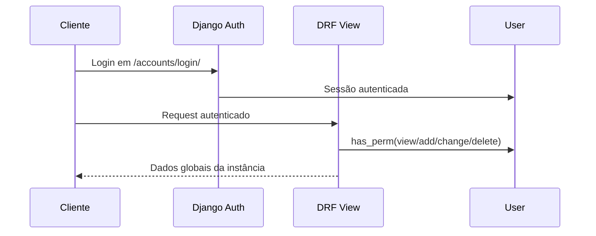

# Autenticação single-instance

## Fluxo de acesso

## Regras implementadas

- O login web usa nome de usuário e senha em `/accounts/login/`; e-mail é
  obrigatório para contato, mas não autentica.
- Usuários autenticados são redirecionados para `/app/`.
- `/admin/login/` redireciona para o mesmo login e preserva somente destinos
  locais sob `/admin/`; não existe autenticação administrativa paralela.
- Menus e ações operacionais usam permissões nativas `view`, `add`, `change` e
  `delete`.
- Nas APIs, `POST` de criação exige `add`; ações customizadas que alteram um
  registro ou processo (`approve`, `release`, `cancel` e equivalentes) exigem
  `change` no model do ViewSet.
- O runtime operacional não exige header de escopo, domínio dedicado ou seleção
  em sessão.
- A API `/api/accounts/me/` retorna o usuário autenticado sem contrato de
  escopo SaaS.
- Fluxos herdados de associação SaaS não fazem parte da navegação operacional.
- A rota `/platform/` não existe. Administração de usuários, grupos e permissões
  ocorre exclusivamente no Django Admin padrão.

## Pontos de extensão

- Novos módulos operacionais devem registrar permissões Django e integrá-las ao
  CRUD genérico.
- Novos módulos não devem introduzir campo operacional de escopo SaaS.
- Alterações de modelo devem vir acompanhadas de migration e teste de permissão
  global.
