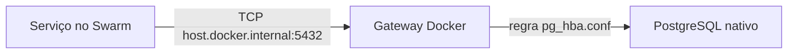
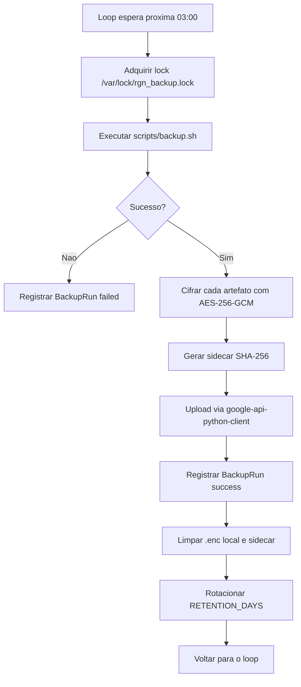
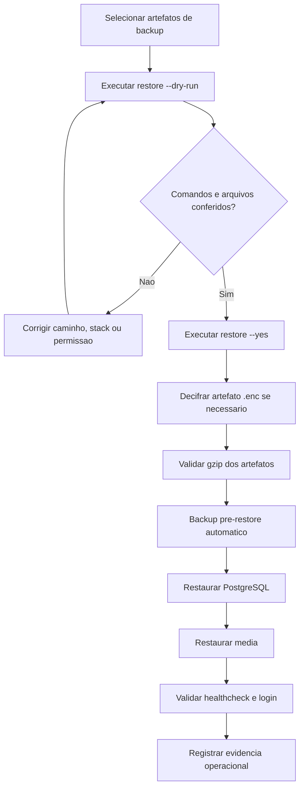

# Backup, Restauração e Recuperação Operacional

Documento canônico: `docs/architecture/backup-restore.md`.

## Escopo

Esta página define backup e restauração do RGN Farma System. O release vigente
na Contabo usa PostgreSQL e mídia em volumes do `docker-compose.vps.yml`; o
backup de release executa `pg_dump` dentro de `db` e monta o volume de mídia
somente para leitura. O modo PostgreSQL nativo permanece suportado pelos scripts
de continuidade e pelos testes históricos. O runbook da VPS é
[`docs/DEPLOY_VPS.md`](../DEPLOY_VPS.md).

Antes de qualquer migration do release, valide `gzip -t`, `tar -tzf` e
`sha256sum -c` para os dois artefatos. Preserve o backup e o SHA anterior até o
aceite público.

## Topologia do banco

Em produção, `app`, workers e scripts usam `host.docker.internal:5432`. A entrada
`host-gateway` da stack encaminha o TCP à interface Docker do host, onde o
PostgreSQL escuta apenas os endereços necessários. `pg_hba.conf` restringe a
subnet do gateway com autenticação `scram-sha-256`; a porta 5432 permanece
bloqueada externamente.



No modo `external`, `scripts/backup.sh` executa `pg_dump` e
`scripts/restore.sh` executa `psql` diretamente com as variáveis `DB_HOST`,
`DB_PORT`, `POSTGRES_USER`, `POSTGRES_DB` e `POSTGRES_PASSWORD`. A senha é
passada somente pelo ambiente do processo e os dry-runs exibem `<redacted>`.
No modo `container`, os mesmos scripts localizam o serviço `db` e executam os
clientes dentro do container.

## Execução local

O template `.env.development.example` já configura `DB_DEPLOYMENT=external`,
`DB_HOST=127.0.0.1`, as credenciais do PostgreSQL de desenvolvimento,
`MEDIA_DIR=media` e `BACKUP_DIR=backups`. Depois de ajustar as credenciais ao
banco criado localmente, carregue o ambiente e execute:

```bash
.venv/bin/python scripts/run_with_env.py --env-file .env -- bash scripts/backup.sh
```

Os dumps locais ficam em `backups/`, diretório ignorado pelo Git. Para conferir
um artefato sem alterar o banco, use o restore em modo de simulação:

```bash
.venv/bin/python scripts/run_with_env.py --env-file .env -- \
  bash scripts/restore.sh \
  --postgres backups/postgres-AAAAMMDD-HHMMSS.sql.gz \
  --dry-run
```

## Objetivo de recuperação

- RPO alvo: até 24 horas para rotinas diárias em produção.
- RTO alvo: restauração técnica inicial em até 2 horas após disponibilidade dos
  artefatos de backup.
- Escopo mínimo: PostgreSQL e `/app/media`.
- Evidência obrigatória: execução de `check_backup_restore_readiness`.
- Evidência auditável: registros em `auxiliary.BackupRun` para cada artefato
  enviado ao Google Drive (BPF/ALCOA+).

## Artefatos

`scripts/backup.sh` cria artefatos versionados por timestamp:

- `postgres-YYYYmmdd-HHMMSS.sql.gz`
- `media-YYYYmmdd-HHMMSS.tar.gz`

A retenção é controlada por `RETENTION_DAYS`, com padrão de 14 dias.
O artefato de mídia é criado em arquivo temporário e publicado por renomeação
atômica somente quando não está vazio. Se o container `app` não estiver
disponível, o script usa `MEDIA_DIR` quando esse diretório existe; sem nenhuma
das duas fontes, o ciclo falha sem publicar um artefato de mídia incompleto.

## Backup para Google Drive (diário)

O serviço `backup_uploader` definido em `docker-stack.yml` é responsável por
manter uma cópia off-site dos artefatos:

- Permanece em loop aguardando a janela configurada (padrão 03:00 `America/Recife`).
- Reaproveita `scripts/backup.sh` para gerar dumps consistentes.
- Cifra cada artefato em AES-256-GCM (chave de `DATA_ENCRYPTION_KEYS`) antes de
  subir, garantindo confidencialidade mesmo que a pasta do Drive seja acessada
  por terceiros.
- Gera sidecar `<arquivo>.enc.sha256` para verificação ALCOA+ pós-download.
- Sobe o arquivo via `google-api-python-client` usando Service Account
  (`GOOGLE_DRIVE_SERVICE_ACCOUNT_JSON` Docker secret).
- Registra cada execução em `auxiliary.BackupRun` (status, SHA-256, `drive_file_id`,
  duração, `triggered_by`).
- Faz rotação local por `BACKUP_RETENTION_DAYS` e remove versões antigas do
  Drive quando a pasta é gerenciada pelo conector.
- Se qualquer upload falhar, o ciclo retorna erro e não atualiza os marcadores
  de saúde nem registra a mensagem de ciclo concluído.
- Quando o upload está habilitado e a pasta está configurada, credenciais
  ausentes também fazem o ciclo falhar. Execução sem upload só é sucesso quando
  `BACKUP_GDRIVE_ENABLED=false` ou durante pre-restore com
  `BACKUP_SKIP_UPLOAD_DURING_RESTORE=true`.
- Com upload habilitado fora de pre-restore, `BACKUP_GDRIVE_FOLDER_ID` vazio é
  configuração inválida e encerra o ciclo antes dos marcadores de saúde.

### Configuração obrigatória

| Variável | Descrição |
|---|---|
| `BACKUP_GDRIVE_ENABLED` | `true` para habilitar upload. |
| `BACKUP_GDRIVE_FOLDER_ID` | ID da pasta no Google Drive (compartilhada com a service account). |
| `BACKUP_GDRIVE_CREDENTIALS_PATH` | Caminho do JSON da service account. Padrão: `/run/secrets/GOOGLE_DRIVE_SERVICE_ACCOUNT_JSON`. |
| `BACKUP_GDRIVE_CREDENTIALS_BASE64` | Alternativa base64 (dev local). |
| `BACKUP_CRON_HOUR` / `BACKUP_CRON_MINUTE` | Janela de execução diária (timezone `TZ`). |
| `BACKUP_RETENTION_DAYS` | Dias para manter artefatos locais. |
| `BACKUP_TRIGGERED_BY` | Rótulo da origem (padrão `cron`). |

### Provisionar a Service Account

```bash
# 1. Criar Service Account no Google Cloud Console com papel
#    "Google Drive File Owner" restrito a pasta alvo.
# 2. Baixar o JSON.
# 3. Criar Docker secret no manager Swarm:
docker secret create GOOGLE_DRIVE_SERVICE_ACCOUNT_JSON gdrive-sa.json
# 4. Compartilhar a pasta do Drive com o client_email do JSON.
# 5. Definir BACKUP_GDRIVE_FOLDER_ID com o ID da pasta.
```

### Sequência do backup diário



## Restore Controlado

`scripts/restore.sh` exige artefatos explícitos:

```bash
bash scripts/restore.sh --postgres /backup/postgres.sql.gz --media /backup/media.tar.gz --dry-run
bash scripts/restore.sh --postgres /backup/postgres.sql.gz --media /backup/media.tar.gz --yes
# arquivos .enc baixados do Drive:
bash scripts/restore.sh --postgres /backup/postgres.sql.gz.enc --media /backup/media.tar.gz.enc --yes
```

O restore real sem `--dry-run` é bloqueado quando `--yes` não é informado.

Antes de restaurar, o script executa `scripts/backup.sh` apontando para um
diretório `pre-restore-*`. Esse backup preserva o estado imediatamente anterior
à restauração e é gerado com `BACKUP_SKIP_UPLOAD_DURING_RESTORE=true` para
evitar uploads durante o restore.

Na restauração de banco, o schema `public` é recriado antes da importação do
dump para evitar conflito com objetos já existentes. Esse passo só ocorre após
o backup `pre-restore` e a confirmação explícita com `--yes`.

Para arquivos `.enc`, `scripts/restore.sh` invoca o comando Django
`decrypt_backup` automaticamente, validando o SHA-256 do sidecar.
Antes do backup `pre-restore` e de qualquer `DROP SCHEMA` ou importação, o
script valida com `gzip -t --` tanto artefatos diretos quanto os arquivos
resultantes da decifragem. Uma falha interrompe o restore sem executar `psql`.

Com `MEDIA_DEPLOYMENT=external`, a mídia é restaurada diretamente em
`MEDIA_DIR`, sem Docker. `scripts/restore_media.py` rejeita caminhos absolutos,
`..`, links e arquivos especiais; extrai em staging no mesmo filesystem e só
então troca o diretório de destino de forma atômica. Com
`MEDIA_DEPLOYMENT=container`, permanece disponível o fluxo por `docker cp`.

## Sequência Operacional



## Comandos de Verificação

```bash
.venv/bin/python manage.py check_backup_restore_readiness
.venv/bin/python manage.py check_backup_restore_readiness --format json
.venv/bin/python manage.py check_backup_restore_readiness --fail-on-error
.venv/bin/python manage.py upload_backup --source /var/backups/rgnfarmasystem/postgres-YYYYMMDD-HHMMSS.sql.gz --kind postgres --json
.venv/bin/python manage.py decrypt_backup --source /var/backups/rgnfarmasystem/postgres-YYYYMMDD-HHMMSS.sql.gz.enc --kind postgres
```

## Critério de Aceitação

- Produção usa `DB_DEPLOYMENT=external` e `host.docker.internal`.
- Backup e restore usam `pg_dump`/`psql` diretamente no modo externo.
- Credenciais nunca aparecem no log nem nos artefatos versionados.
- Um restore isolado comprova cada ciclo de backup antes da expiração da retenção.
- Backup de PostgreSQL usa `pg_dump` com compactação `gzip`.
- Backup de mídia inclui `/app/media`.
- Backup de mídia é atômico, não vazio e obrigatório para o sucesso do ciclo.
- Rotação por `RETENTION_DAYS` está habilitada.
- Restauração exige `--postgres` e/ou `--media`.
- Restore real exige `--yes`.
- `--dry-run` não altera banco nem mídia.
- Backup `pre-restore` é executado antes de qualquer alteração real.
- Todo gzip, inclusive após decifragem, é validado antes de qualquer operação
  destrutiva do restore.
- Restore de PostgreSQL recria o schema `public` antes de importar o dump.
- Backup diário para o Google Drive é executado por serviço dedicado e cifra
  cada artefato com AES-256-GCM antes do upload.
- Cada execução de upload é registrada em `auxiliary.BackupRun`.
- Documentação e MKDocs incluem este plano.
