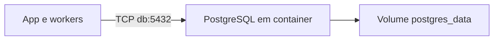
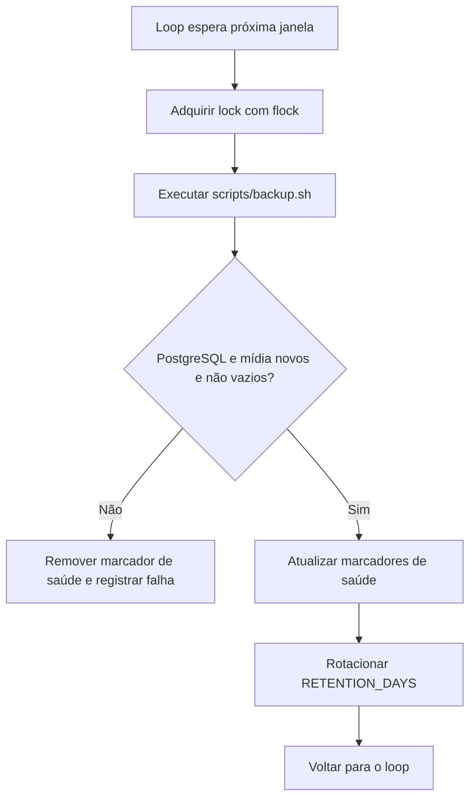
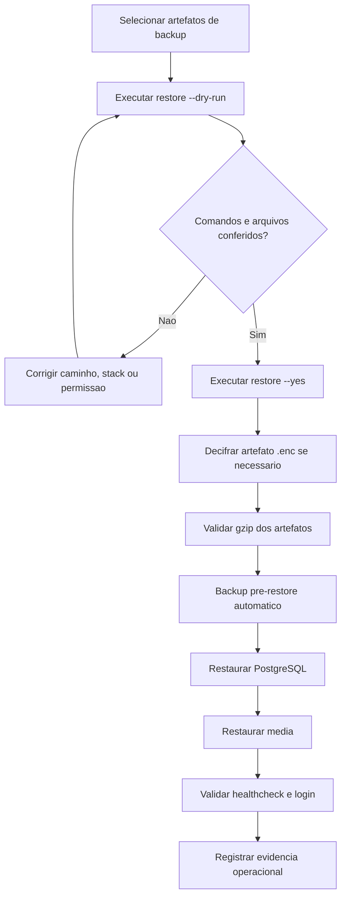

# Backup, Restauração e Recuperação Operacional

Documento canônico: `docs/architecture/backup-restore.md`.

## Escopo

Esta página define backup e restauração do RGN Farma System. O release vigente
na Contabo usa PostgreSQL e mídia em volumes do `docker-compose.vps.yml`; o
backup de release executa `pg_dump` dentro de `db` e monta o volume de mídia
somente para leitura. O modo PostgreSQL nativo permanece suportado pelos scripts
de continuidade e pelos testes históricos. O runbook da VPS é
[`docs/DEPLOY_VPS.md`](../DEPLOY_VPS.md).

Antes de qualquer migration do release, valide `gzip -t`, `tar -tzf` e
`sha256sum -c` para os dois artefatos. Preserve o backup e o SHA anterior até o
aceite público.

## Topologia do banco

Em produção, `app` e workers usam `db:5432` na rede privada `backend` do
Docker Compose. O serviço `db` não publica portas no host; somente os serviços
da mesma rede alcançam o PostgreSQL.



No modo canônico `container`, os scripts localizam `db` pelas labels do Docker
Compose e executam os clientes dentro do container. O modo `external` permanece
apenas para recuperação de instalações legadas.

## Execução local

O ambiente local usa `.env.local` e `docker-compose.local.yml`. Depois de subir
os serviços, execute o backup no host, apontando para a topologia Compose:

```bash
DB_DEPLOYMENT=container COMPOSE_PROJECT_NAME=rgnfarmasystem-local BACKUP_DIR=backups bash scripts/backup.sh
```

Os dumps locais ficam em `backups/`, diretório ignorado pelo Git. Para conferir
um artefato sem alterar o banco, use o restore em modo de simulação:

```bash
DB_DEPLOYMENT=container COMPOSE_PROJECT_NAME=rgnfarmasystem-local BACKUP_DIR=backups \
  bash scripts/restore.sh \
  --postgres backups/postgres-AAAAMMDD-HHMMSS.sql.gz \
  --dry-run
```

## Objetivo de recuperação

- RPO alvo: até 24 horas para rotinas diárias em produção.
- RTO alvo: restauração técnica inicial em até 2 horas após disponibilidade dos
  artefatos de backup.
- Escopo mínimo: PostgreSQL e `/app/media`.
- Evidência obrigatória: execução de `check_backup_restore_readiness`.
- Evidência auditável: artefatos com timestamp, hashes SHA-256, logs do scheduler
  e marcadores locais de último ciclo íntegro.

## Artefatos

`scripts/backup.sh` cria artefatos versionados por timestamp:

- `postgres-YYYYmmdd-HHMMSS.sql.gz`
- `media-YYYYmmdd-HHMMSS.tar.gz`

A retenção é controlada por `RETENTION_DAYS`, com padrão de 14 dias.
O artefato de mídia é criado em arquivo temporário e publicado por renomeação
atômica somente quando não está vazio. Se o container `app` não estiver
disponível, o script usa `MEDIA_DIR` quando esse diretório existe; sem nenhuma
das duas fontes, o ciclo falha sem publicar um artefato de mídia incompleto.

## Backup local diário

O serviço `backup_scheduler` definido em `docker-compose.vps.yml` mantém os
artefatos no volume local de backups:

- aguarda a janela configurada, por padrão 03:00 em `America/Recife`;
- usa `flock` para impedir ciclos concorrentes;
- reaproveita `scripts/backup.sh` para gerar dumps consistentes;
- exige um arquivo novo e não vazio de PostgreSQL e outro de mídia;
- só atualiza `/tmp/backup_scheduler_ready` e `last_backup_ok` após validar os
  dois artefatos do ciclo atual;
- aplica a retenção local definida por `BACKUP_RETENTION_DAYS`.

O scheduler não depende do ORM ou da disponibilidade HTTP da aplicação. Essa
separação permite preservar o banco e a mídia em cenários de degradação do app.

### Configuração obrigatória

| Variável | Descrição |
|---|---|
| `BACKUP_CRON_HOUR` / `BACKUP_CRON_MINUTE` | Janela de execução diária (timezone `TZ`). |
| `BACKUP_RETENTION_DAYS` | Dias para manter artefatos locais. |

### Sequência do backup diário



## Restore Controlado

`scripts/restore.sh` exige artefatos explícitos:

```bash
bash scripts/restore.sh --postgres /backup/postgres.sql.gz --media /backup/media.tar.gz --dry-run
bash scripts/restore.sh --postgres /backup/postgres.sql.gz --media /backup/media.tar.gz --yes
# artefatos históricos cifrados:
bash scripts/restore.sh --postgres /backup/postgres.sql.gz.enc --media /backup/media.tar.gz.enc --yes
```

O restore real sem `--dry-run` é bloqueado quando `--yes` não é informado.

Antes de restaurar, o script executa `scripts/backup.sh` apontando para um
diretório `pre-restore-*`. Esse backup preserva o estado imediatamente anterior
à restauração e usa exclusivamente o armazenamento local.

Na restauração de banco, o schema `public` é recriado antes da importação do
dump para evitar conflito com objetos já existentes. Esse passo só ocorre após
o backup `pre-restore` e a confirmação explícita com `--yes`.

Para arquivos `.enc`, `scripts/restore.sh` invoca o comando Django
`decrypt_backup` automaticamente, validando o SHA-256 do sidecar.
Antes do backup `pre-restore` e de qualquer `DROP SCHEMA` ou importação, o
script valida com `gzip -t --` tanto artefatos diretos quanto os arquivos
resultantes da decifragem. Uma falha interrompe o restore sem executar `psql`.

Com `MEDIA_DEPLOYMENT=external`, a mídia é restaurada diretamente em
`MEDIA_DIR`, sem Docker. `scripts/restore_media.py` rejeita caminhos absolutos,
`..`, links e arquivos especiais; extrai em staging no mesmo filesystem e só
então troca o diretório de destino de forma atômica. Com
`MEDIA_DEPLOYMENT=container`, permanece disponível o fluxo por `docker cp`.

## Sequência Operacional



## Comandos de Verificação

```bash
.venv/bin/python manage.py check_backup_restore_readiness
.venv/bin/python manage.py check_backup_restore_readiness --format json
.venv/bin/python manage.py check_backup_restore_readiness --fail-on-error
.venv/bin/python manage.py decrypt_backup --source /var/backups/rgnfarmasystem/postgres-YYYYMMDD-HHMMSS.sql.gz.enc --kind postgres
```

## Critério de Aceitação

- Produção usa `DB_DEPLOYMENT=container` e o host privado `db`.
- Backup e restore usam `pg_dump`/`psql` dentro do container PostgreSQL.
- Credenciais nunca aparecem no log nem nos artefatos versionados.
- Um restore isolado comprova cada ciclo de backup antes da expiração da retenção.
- Backup de PostgreSQL usa `pg_dump` com compactação `gzip`.
- Backup de mídia inclui `/app/media`.
- Backup de mídia é atômico, não vazio e obrigatório para o sucesso do ciclo.
- Rotação por `RETENTION_DAYS` está habilitada.
- Restauração exige `--postgres` e/ou `--media`.
- Restore real exige `--yes`.
- `--dry-run` não altera banco nem mídia.
- Backup `pre-restore` é executado antes de qualquer alteração real.
- Todo gzip, inclusive após decifragem, é validado antes de qualquer operação
  destrutiva do restore.
- Restore de PostgreSQL recria o schema `public` antes de importar o dump.
- Backup diário local é executado pelo serviço dedicado `backup_scheduler`.
- Marcadores de saúde só são publicados após artefatos novos e não vazios de
  PostgreSQL e mídia.
- Documentação e MKDocs incluem este plano.
