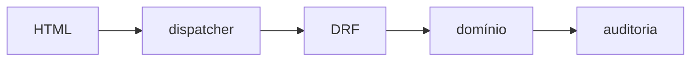

# Ações operacionais

## Contrato

O catálogo HTML cobre exatamente as 258 ações `POST` descobertas nos ViewSets
DRF: 252 são ações de detalhe e seis ações de coleção. Igualdade de conjuntos,
e não somente a contagem, impede ação órfã, duplicada ou publicada sem interface.



Em forma compacta: `HTML --> dispatcher --> DRF --> domínio --> auditoria`.
O dispatcher reutiliza o callback registrado pelo router; não copia métodos
como `approve`, `release`, `close` ou `cancel`. Permissões, locks, transações,
validações, efeitos colaterais e auditoria permanecem no DRF e no domínio.

## Metadados

Cada `ActionConfig` é imutável e declara recurso, model, rota reversível,
permissões, rótulo pt-BR, campos, confirmação, resposta de sucesso e estratégia
de navegação. `ActionField` cobre texto, textarea, números, booleano, data,
data/hora, choice, relação, arquivo, JSON e valor oculto.

`allowed_states` e `state_field` controlam a visibilidade antes do envio. A
matriz reproduz guards de domínio e suporta campos como `status`, `stage`,
`decision`, `release_status`, `quality_status`, `emission_status`,
`result_status` e `response_status`. Das ações de detalhe, 238 declaram ciclo
de vida; as outras 14 pertencem a models sem esse campo. As seis ações de
coleção não dependem de objeto.

O estado é novamente validado pela API. Se o registro mudar entre a renderização
e o envio, o fallback retorna conflito seguro e solicita atualização da página.

## Formulários e acessibilidade

- A página de detalhe mostra apenas ações permitidas ao usuário e ao estado.
- Operações críticas exigem confirmação e, quando definido, frase digitada.
- Choices vêm dos `TextChoices`; relações respeitam `view` do model relacionado.
- O modal é aprimoramento progressivo. O link sempre abre uma página de
  fallback sem JavaScript com CSRF, erros por campo e valores preservados.
- Mensagens inesperadas não exibem traceback ou segredo e incluem apenas um
  identificador de requisição seguro.

## Extensão e gates

Ao criar futura `@action(methods=['post'])`, atualize `ACTION_KEYS`, payload,
cópia pt-BR e matriz de estados. O teste
`test_html_catalog_exactly_matches_post_actions` falha até a configuração HTML
correspondente existir.

```bash
./scripts/test.sh tests/test_action_*.py -q
```
