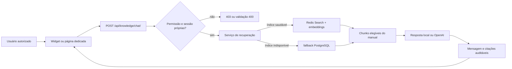

# Assistente RAG somente leitura

## Objetivo e fronteira de segurança

O módulo `knowledge` oferece consulta ao manual operacional do RGN Farma
System com recuperação de contexto, respostas conversacionais e citações. O
chat é **somente leitura**: não executa SQL, não cria nem altera registros e
não possui ferramentas para iniciar workflows, CAPA, Ishikawa ou qualquer
outra ação governada.

O acesso exige autenticação e a permissão Django
`knowledge.view_ragchatsession`. O mesmo controle protege a API, o widget
global e a página dedicada. Sessões e mensagens aplicam isolamento por usuário:
um usuário não pode listar nem continuar a conversa de outro.

Somente fontes ativas com `source_type=system_manual` e
`chat_eligible=True` participam da recuperação. Cadastrar uma fonte externa
não a torna elegível automaticamente. Essa restrição evita incorporar conteúdo
regulatório ou protegido ao prompt sem curadoria e autorização explícitas.

## Arquitetura



O PostgreSQL é a fonte de verdade para fontes, documentos, chunks, gerações de
índice, conversas, mensagens, citações e logs de ingestão. O Redis contém uma
projeção vetorial reconstruível. O alias ativo é reconciliado com a geração
marcada como ativa no banco. Se Redis ou o alias estiver indisponível, o
serviço usa o **fallback PostgreSQL** lexical e continua limitado ao manual
elegível.

`RAG_CHAT_LOCAL_ONLY=True` desativa a geração remota de respostas e permite
validar persistência, permissões, recuperação e citações sem depender da
OpenAI. Quando esse modo está desativado, falhas do provedor são registradas
sem devolver payloads internos ou segredos ao navegador.

## Preparação e publicação

Execute na raiz do projeto, com o ambiente configurado:

```bash
.venv/bin/python manage.py migrate
.venv/bin/python manage.py build_erp_manual_corpus
.venv/bin/python manage.py rebuild_knowledge_index
.venv/bin/python manage.py reconcile_knowledge_alias
```

`build_erp_manual_corpus` gera documentos e chunks a partir do catálogo manual
mantido em código. O comando pode ser limitado por `--module`. A ingestão é
explícita e idempotente por hash; ela não varre tabelas operacionais nem fontes
externas de forma implícita.

`rebuild_knowledge_index` cria uma geração nova antes de publicar o alias. Não
trate o Redis como backup do corpus. Após restauração do PostgreSQL, reconstrua
o índice e execute `reconcile_knowledge_alias`.

## Rollout validado

1. Aplique migrations e gere o corpus.
2. Defina `RAG_CHAT_LOCAL_ONLY=True` e valide autenticação, permissão,
   isolamento por usuário, duas perguntas na mesma sessão e citações.
3. Com Redis desligado, confirme uma resposta pelo fallback PostgreSQL.
4. Habilite Redis, reconstrua o índice e reconcilie o alias.
5. Configure OpenAI por segredo de ambiente, desative o modo local e repita o
   smoke test sem registrar chave, prompt completo ou payload do provedor.
6. Conceda `knowledge.view_ragchatsession` somente aos grupos aprovados.

## Operação e diagnóstico

- Sem widget e API retornando 403: confira usuário ativo e a permissão
  `knowledge.view_ragchatsession`.
- Resposta sem contexto vetorial: confira uma geração ativa, saúde do Redis e o
  alias; o fallback PostgreSQL deve permanecer disponível.
- Nenhum resultado: confirme que o corpus foi criado e que fonte e documento
  estão ativos, ingeridos, do tipo manual e elegíveis para chat.
- Sessão rejeitada com 400: o ID não existe, está fechado ou pertence a outro
  usuário; inicie uma nova conversa.
- Provedor indisponível: ative temporariamente `RAG_CHAT_LOCAL_ONLY=True` e
  preserve logs sem conteúdo sensível.

## Rollback e desativação

O rollback funcional mais seguro é remover
`knowledge.view_ragchatsession` dos grupos. Isso oculta o widget e bloqueia a
API e a página dedicada sem apagar histórico, mensagens ou citações. Para
desativar apenas a dependência externa, use `RAG_CHAT_LOCAL_ONLY=True`. Para
recuperar um alias inconsistente, restaure a geração ativa correta no banco e
execute `reconcile_knowledge_alias`.

Não apague conversas como mecanismo de rollback. A retenção deve seguir a
política de integridade de dados, auditoria e validação aplicável ao ambiente.

