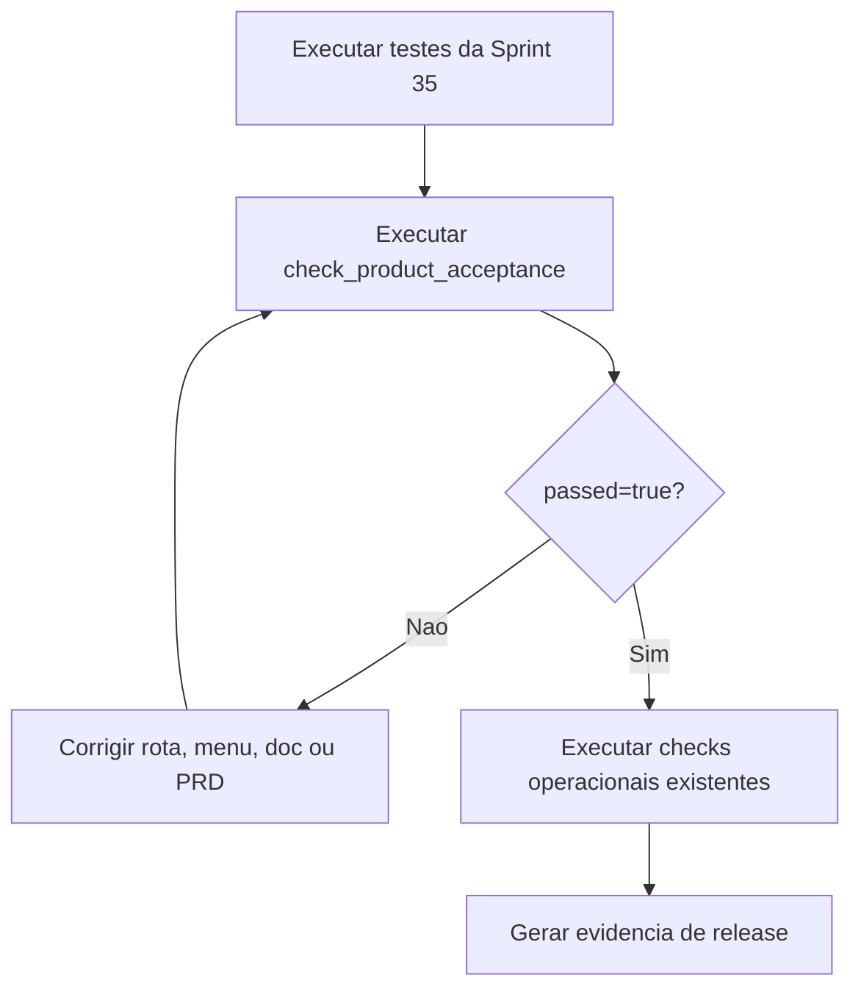

# Aceite Técnico de Produto

Documento canônico: `docs/architecture/product-acceptance.md`.

## Escopo

Esta página define o gate de aceite técnico final do RGN Farma System após as
Sprints 1 a 34. O objetivo é gerar evidência objetiva de que rotas, APIs,
menus, comandos operacionais, documentação e PRD permanecem coerentes.

O gate não acessa banco de dados, não executa restore real e não depende de
serviços externos.

## Comando

```bash
.venv/bin/python manage.py check_product_acceptance
.venv/bin/python manage.py check_product_acceptance --format json
.venv/bin/python manage.py check_product_acceptance --fail-on-error
```

## Cobertura

- Rotas principais: `/health/`, `/`, `/api/v1/`, `/api/schema/`, `/api/docs/`
  e Django admin.
- Publicação dos módulos principais no namespace `/api/v1/*`.
- Fronteira do Django Admin: ausente do sidebar operacional, protegida por
  `is_active`/`is_staff` e autenticada pelo login único.
- Comandos operacionais: `check_operational_readiness`,
  `check_backup_restore_readiness`, `check_transversal_compliance` e
  `check_product_acceptance`.
- Documentação navegável no MKDocs para deploy, compliance, prontidão
  operacional, backup/restauração e aceite de produto.
- Registro das Sprints 35 e 44 no `PRD.md`.

## Sequência de Aceite



## Critério de Aceitação

- `check_product_acceptance --format json` retorna `passed=true`.
- `check_product_acceptance --fail-on-error` termina com exit code 0.
- `pytest tests/test_product_acceptance.py` passa.
- `check_operational_readiness --fail-on-error` continua passando.
- `check_backup_restore_readiness --fail-on-error` continua passando.
- `mkdocs build --strict` inclui esta página.
