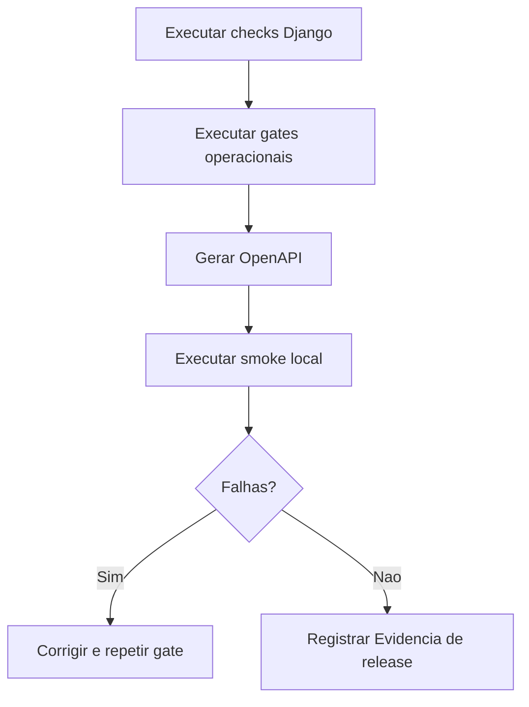

# Prontidão de Release e Staging Local

Documento canônico: `docs/architecture/release-readiness.md`.

## Escopo

Esta página define o gate de prontidão de release e staging local do RGN Farma
System após o aceite técnico de produto. O objetivo é consolidar evidências
antes de promover uma versão interna, sem depender de VPS real, Cloudflare,
domínio público ou credenciais de produção.

O gate não acessa banco de dados, não executa deploy real e não inicia servidor
HTTP por conta própria.

## Comando

```bash
.venv/bin/python manage.py check_release_readiness
.venv/bin/python manage.py check_release_readiness --format json
.venv/bin/python manage.py check_release_readiness --fail-on-error
```

## Gates Obrigatórios

Antes de declarar o release pronto, execute:

```bash
.venv/bin/python manage.py check
.venv/bin/python manage.py makemigrations --check --dry-run
.venv/bin/python manage.py check_operational_readiness --fail-on-error
.venv/bin/python manage.py check_backup_restore_readiness --fail-on-error
.venv/bin/python manage.py check_product_acceptance --fail-on-error
.venv/bin/python manage.py check_release_readiness --fail-on-error
```

## OpenAPI

Gere o schema versionável para revisão técnica:

```bash
.venv/bin/python manage.py spectacular --file openapi-schema.yml
```

O arquivo `openapi-schema.yml` é evidência transitória de release. Ele deve ser
anexado ao pacote de evidência quando necessário e não precisa ser versionado.

## Smoke Local

Com o servidor local ou container de staging em execução, valide:

```bash
curl -fsS http://127.0.0.1:8000/health/
curl -fsS http://127.0.0.1:8000/
curl -fsS http://127.0.0.1:8000/api/schema/
curl -fsS http://127.0.0.1:8000/api/docs/
curl -fsS http://127.0.0.1:8000/api/v1/
```

Falha em qualquer comando deve bloquear o release interno até investigação.

## Dados Demo Para Staging

Para preparar dados de demonstração local no PostgreSQL configurado em `.env`:

```bash
.venv/bin/python manage.py load_demo_scenario --scenario base_master_data quality_deviation
```

O comando `load_demo_scenario` registra a execução e cria dados de governança
compatíveis com demonstração e revisão interna.

## Evidencia de release

Registre no pacote de release:

- Hash do commit.
- Resultado de `manage.py check`.
- Resultado de `makemigrations --check --dry-run`.
- Resultado dos comandos `check_operational_readiness`,
  `check_backup_restore_readiness`, `check_product_acceptance` e
  `check_release_readiness`.
- Arquivo `openapi-schema.yml` gerado para a versão.
- Evidência do smoke local de `/health/`, `/`, `/api/schema/`, `/api/docs/`
  e `/api/v1/`.
- Confirmação de que nenhum segredo real foi registrado em documentação, logs
  ou artefatos.

## Sequência



## Critério de Aceitação

- `check_release_readiness --format json` retorna `passed=true`.
- `check_release_readiness --fail-on-error` termina com exit code 0.
- `check_product_acceptance --fail-on-error` continua passando.
- `spectacular --file openapi-schema.yml` gera schema OpenAPI.
- Smoke local cobre `/health/`, `/`, `/api/schema/`, `/api/docs/` e `/api/v1/`.
- `pytest tests/test_release_readiness.py` passa.
- `mkdocs build --strict` inclui esta página.
