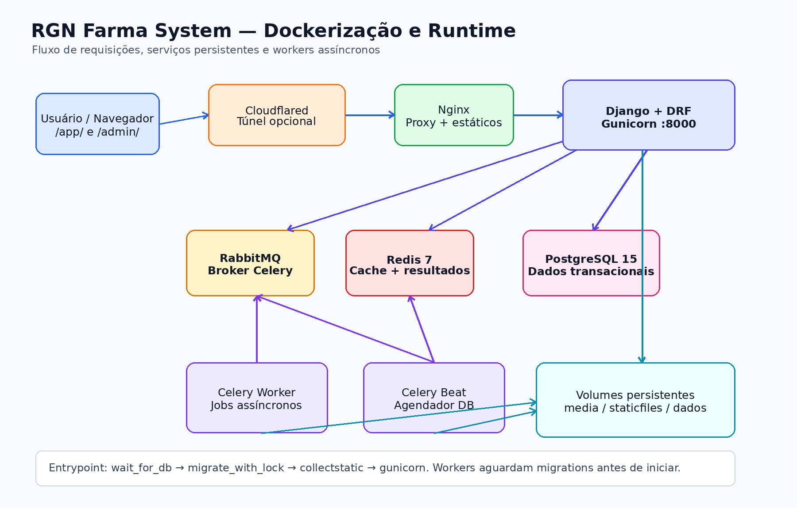
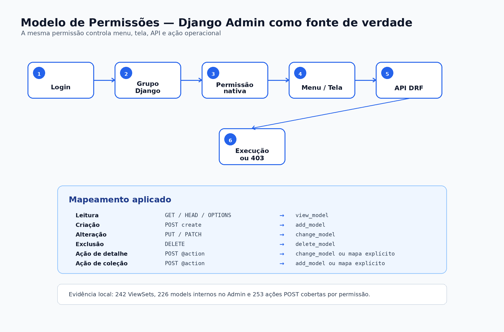

# RGN Farma System — Especificação Técnica

## Sumário

1. Identificação do documento
2. Objetivo
3. Escopo arquitetural
4. Visão geral da arquitetura
5. Dockerização
6. Configuração Django
7. Modelo de permissões
8. Mapa de módulos
9. Interface web
10. APIs REST
11. Banco de dados
12. Segurança
13. Auditoria, ALCOA+ e GxP
14. Integrações
15. Observabilidade e operação
16. Backup e restauração
17. Critérios técnicos de homologação
18. Pontos de atenção antes de produção
19. Conclusão técnica

## Identificação do documento

| Campo | Informação |
|---|---|
| Produto | RGN Farma System |
| Tipo | ERP web single-instance para indústria farmacêutica |
| Versão documental | 1.0 |
| Data | 21/07/2026 |
| Empresa desenvolvedora | RGN SYSTEMS TECNOLOGIA INOVA SIMPLES (I.S.) |
| CNPJ | 67.956.492/0001-64 |
| Endereço | Rua Doutor Joao Marques, 60, Ilha do Retiro — Recife/PE, CEP 50750-320 |
| Stack principal | Python, Django, Django REST Framework, PostgreSQL, Redis, Celery, RabbitMQ, Docker, Nginx, Bootstrap 5, JavaScript, HTML5, CSS3 |

## Objetivo

Este documento descreve a especificação técnica do RGN Farma System para apoiar homologação, operação assistida, validação técnica e transferência de conhecimento. O foco é registrar a arquitetura real do projeto, a dockerização, a estratégia de permissões baseada no Django Admin, os módulos funcionais, os controles de segurança e os critérios mínimos de aceite técnico.

O sistema foi concebido para atender uma operação farmacêutica integrada, com módulos de produção, planejamento, compras, estoque, custos, financeiro, fiscal, CRM, qualidade, garantia da qualidade, documentos, desvios, CAPA, mudanças, auditorias, riscos, assuntos regulatórios, farmacovigilância, recalls, manutenção, treinamentos, workflow, relatórios, integrações, agentes de IA e base regulatória RAG.

## Escopo arquitetural

O runtime atual é single-instance. Isso significa que a aplicação opera como uma instância única, sem seleção de tenant, sem header de escopo por cliente e sem roteamento por subdomínio de cliente para os módulos operacionais. Usuários, grupos e permissões nativas do Django são a fonte de verdade para controle de acesso.

Os principais pontos da conversão para single-instance são:

- `/accounts/login/` é o login operacional único.
- `/app/` é a entrada principal da interface operacional.
- `/admin/` permanece como Django Admin padrão, separado da sidebar operacional.
- APIs DRF usam `SingleInstanceDjangoModelPermissions`.
- Menus e recursos da UI usam `user.has_perm`.
- O escopo por cliente legado não é usado no runtime operacional.

## Visão geral da arquitetura

O RGN Farma System segue uma arquitetura web tradicional, com aplicação Django servindo HTML, APIs REST e comandos operacionais. A persistência transacional usa PostgreSQL. Redis é usado para cache e backend de resultados Celery. RabbitMQ é o broker de mensagens para tarefas assíncronas. Celery Worker executa jobs de longa duração e Celery Beat agenda tarefas periódicas com `django-celery-beat`.



### Componentes principais

| Componente | Responsabilidade |
|---|---|
| Django | Aplicação web, templates, autenticação, permissões, Admin, models, forms e comandos |
| Django REST Framework | APIs REST, serializers, ViewSets, roteamento e controle de permissões |
| PostgreSQL 15 | Banco transacional principal |
| Redis 7 | Cache e backend de resultado Celery |
| RabbitMQ | Broker de filas assíncronas |
| Celery Worker | Execução de jobs, rotinas técnicas e tarefas demoradas |
| Celery Beat | Agendamento periódico via banco |
| Nginx | Proxy reverso, entrega de estáticos e mídia em implantação VPS |
| WhiteNoise | Entrega de arquivos estáticos em runtime Django quando aplicável |
| Cloudflared | Túnel opcional para publicação externa controlada |

## Dockerização

O projeto possui `Dockerfile` e composes para execução local, teste e VPS. O contrato principal de publicação em containers utiliza imagem Python 3.13 slim, instalação das dependências de sistema, instalação de `requirements.txt`, cópia do projeto e inicialização por entrypoint.

### Dockerfile

O `Dockerfile` executa:

```dockerfile
FROM python:3.13-slim
WORKDIR /app
RUN apt-get update && apt-get install -y build-essential libpq-dev postgresql-client curl
COPY requirements.txt /app/
RUN pip install --upgrade pip && pip install -r requirements.txt
COPY . /app/
ENTRYPOINT ["/app/entrypoint.sh"]
CMD ["gunicorn", "--bind", "0.0.0.0:8000", "core.wsgi:application"]
```

### Serviços do `docker-compose.yml`

| Serviço | Função | Healthcheck |
|---|---|---|
| `app` | Django/Gunicorn na porta interna 8000 | `GET /health/` |
| `celery_worker` | Processamento assíncrono | `celery inspect ping` |
| `celery_beat` | Agendamento periódico | inspeção de processo Celery Beat |
| `db` | PostgreSQL 15 Alpine | `pg_isready` |
| `redis` | Redis 7 Alpine | `redis-cli ping` |
| `rabbitmq` | RabbitMQ com management | `rabbitmq-diagnostics ping` |
| `cloudflared` | Túnel opcional Cloudflare | dependência do app |

### Entrypoints

O `entrypoint.sh` do app executa:

1. `wait_for_db`
2. `migrate_with_lock`
3. `collectstatic --noinput --clear`
4. inicia o comando final, normalmente Gunicorn

O `worker-entrypoint.sh` executa:

1. `wait_for_db`
2. `wait_for_migrations`
3. inicia worker ou beat

Esse fluxo reduz risco de concorrência em migrations e impede workers de processarem tarefas antes do banco estar no estado esperado.

### Dockerização VPS

O `docker-compose.vps.yml` adiciona Nginx, volumes nomeados e perfil de produção:

- `DJANGO_SETTINGS_MODULE=core.settings.production`
- volumes persistentes: `postgres_data`, `redis_data`, `rabbitmq_data`, `media`, `staticfiles`
- Nginx servindo `/static/` e `/media/`
- proxy HTTP interno para `app:8000`
- `X-Forwarded-Proto` configurado como `https` quando TLS termina antes do container

## Configuração Django

O projeto centraliza configurações em `core/settings/base.py` e usa perfil de produção em `core/settings/production.py`.

### Configurações relevantes

| Configuração | Valor/Comportamento |
|---|---|
| `AUTH_USER_MODEL` | `accounts.User` |
| `LOGIN_URL` | `accounts:login` |
| `LOGIN_REDIRECT_URL` | `/app/` |
| `LANGUAGE_CODE` | `pt-br` |
| `TIME_ZONE` | `America/Recife` |
| `DATABASES` | via `DATABASE_URL` |
| `STATIC_ROOT` | `staticfiles` |
| `MEDIA_ROOT` | `media` por padrão |
| `CELERY_BROKER_URL` | RabbitMQ |
| `CELERY_RESULT_BACKEND` | Redis |
| `DEFAULT_PERMISSION_CLASSES` | `IsAuthenticated` como default DRF |

O perfil de produção valida explicitamente:

- `SECRET_KEY` não pode ser o valor local padrão.
- `DEBUG` deve ser `False`.
- `ALLOWED_HOSTS` deve estar configurado.
- `DATABASE_URL` deve apontar para PostgreSQL.
- `CUSTOMER_APP_BASE_URL` deve usar HTTPS.
- chave de criptografia de dados deve estar configurada.

## Modelo de permissões

O controle de acesso operacional está alinhado ao modelo nativo do Django Admin. Os grupos e permissões são administrados pelo Django Admin; a UI operacional e as APIs consomem as mesmas permissões.



\newpage

### Contrato técnico

O projeto implementa `SingleInstanceDjangoModelPermissions`, uma extensão de `DjangoModelPermissions` do DRF. A diferença essencial é exigir também `view_model` para métodos de leitura.

| Operação | Permissão exigida |
|---|---|
| `GET`, `HEAD`, `OPTIONS` | `app.view_model` |
| `POST` create | `app.add_model` |
| `PUT`, `PATCH` | `app.change_model` |
| `DELETE` | `app.delete_model` |
| `POST @action` de detalhe | `app.change_model` ou mapa explícito |
| `POST @action` de coleção | `app.add_model` ou mapa explícito |

Auditoria local executada em 21/07/2026:

Este é um snapshot histórico, preservado sem atualização retroativa.

- 226 models internos auditados.
- 226/226 models internos registrados no Django Admin.
- 226/226 models com permissões Django criadas no banco.
- 242 ViewSets locais auditados.
- 242/242 ViewSets usando `SingleInstanceDjangoModelPermissions`.
- 240 ações `POST @action` cobertas por permissão padrão ou mapa explícito.
- `manage.py check`: sem issues.
- 49 testes focados em permissões/admin/ações: aprovados.
- `check_security_audit`: aprovado.
- `check_product_acceptance`: aprovado.
- `EV-SIA-ACTION-253` preserva o artefato histórico imutável com SHA-256
  `c5a622328b62e9dc3b2383f8e266d9c6a22a7af4e1eff75e107015b7b4297ea9`.

Auditoria do candidato executada em 27/07/2026:

- código auditado no SHA `2fa9472`;
- 240 ações `POST @action`: 235 de detalhe e 5 de coleção;
- matriz com 238 ações de detalhe com estado, 14 sem estado e 6 de coleção;
- migration `production.0007` aplicada;
- 273 testes operacionais, 14 testes de produção/UI e 62 testes de
  catálogo/documentação aprovados;
- `manage.py check`, `makemigrations --check --dry-run`, Ruff e
  `git diff --check`: sem achados;
- hash do artefato `EV-SIA-ACTION-258`
  `f1c9f7586cfb2722eac6d502cfb09ce0817bca98a5933d95cc8f43f6c229bd79`
  conferido.

Esta auditoria é um registro adicional e não altera o inventário do snapshot de
21/07/2026. Os hashes `EV-SI-005`, `EV-SI-006` e `EV-SI-008` foram
reconciliados em 28/07/2026 após a execução integral dos respectivos testes,
permitindo interpretar estes gates focados como aprovação integral de toda a
evidência histórica.

### Exceções controladas

Alguns endpoints não são recursos de model e usam política própria:

- `/api/accounts/me/`: exige usuário autenticado e retorna o usuário atual.
- `/api/knowledge/chat/`: exige autenticação e `knowledge.view_ragchatsession`, aplica isolamento por usuário e oferece somente leitura com citações; quando Redis está indisponível, usa fallback PostgreSQL restrito ao manual elegível.
- roots dos routers DRF: exigem usuário autenticado e expõem índice da API.
- `/api/schema/` e `/api/docs/`: atualmente públicos; recomenda-se restringir em produção se a política de segurança exigir ocultar contrato de API.

## Mapa de módulos


| Módulo | Models | ViewSets | Admin |
|---|---:|---:|---:|
| auxiliary | 15 | 0 | 15/15 |
| accounts | 1 | 0 | 1/1 |
| masters | 7 | 8 | 7/7 |
| formulations | 4 | 5 | 4/4 |
| production | 2 | 3 | 2/2 |
| planning | 8 | 10 | 8/8 |
| procurement | 9 | 10 | 9/9 |
| inventory | 4 | 5 | 4/4 |
| costing | 7 | 8 | 7/7 |
| finance | 7 | 8 | 7/7 |
| fiscal | 16 | 18 | 16/16 |
| crm | 14 | 15 | 14/14 |
| quality | 6 | 7 | 6/6 |
| qa | 7 | 8 | 7/7 |
| documents | 6 | 7 | 6/6 |
| deviations | 6 | 7 | 6/6 |
| capa | 6 | 7 | 6/6 |
| changes | 6 | 7 | 6/6 |
| audits | 8 | 9 | 8/8 |
| risks | 7 | 8 | 7/7 |
| regulatory | 10 | 11 | 10/10 |
| pharmacovigilance | 7 | 8 | 7/7 |
| recalls | 6 | 7 | 6/6 |
| training | 9 | 10 | 9/9 |
| files | 4 | 5 | 4/4 |
| reports | 6 | 7 | 6/6 |
| workflow | 8 | 9 | 8/8 |
| integrations | 4 | 5 | 4/4 |
| ai_agents | 4 | 5 | 4/4 |
| knowledge | 7 | 7 | 7/7 |
| governance | 5 | 6 | 5/5 |
| compliance | 4 | 5 | 4/4 |

## Interface web

A interface operacional usa templates Django com Bootstrap 5, CSS e JavaScript local. O shell principal fica em `/app/`. A renderização dos módulos é orientada por `base.ui.registry`, que determina:

- módulos visíveis;
- recursos visíveis;
- botões de criar, editar e excluir;
- ações especiais;
- views alternativas como kanban, gantt, chat ou viewer documental quando habilitadas.

A sidebar operacional não substitui o Django Admin; ela apresenta os recursos permitidos para operação diária. O Django Admin permanece reservado à administração técnica, usuários, grupos, permissões e cadastros que exigem controle administrativo.

## APIs REST

As APIs são expostas em `/api/*` e `/api/v1/*`. Ambas reutilizam os mesmos ViewSets e permission classes. Para homologação e documentação externa, recomenda-se tratar `/api/v1/*` como namespace principal versionado.

Recursos REST seguem o padrão:

- listagem;
- detalhe;
- criação;
- atualização total/parcial;
- exclusão quando permitida;
- ações de domínio via `POST @action`.

Exemplos de ações de domínio:

- aprovar, liberar, iniciar, pausar, concluir ou cancelar ordem de produção;
- calcular MRP;
- aprovar custo padrão;
- emitir, cancelar e enviar NF-e;
- coletar, receber, analisar, revisar e aprovar amostras;
- submeter, aprovar, publicar e arquivar documentos;
- iniciar investigação, encerrar desvio, gerar CAPA;
- gerar alertas regulatórios e relatórios.

## Banco de dados

O banco transacional é PostgreSQL. O projeto usa migrations Django e o comando `migrate_with_lock` para reduzir concorrência em ambientes containerizados. A modelagem atual é single-instance; as permissões são gerenciadas por `auth_permission`, `auth_group`, `auth_user_user_permissions` e tabelas relacionadas do Django.

Regras importantes:

- integridade referencial por foreign keys;
- validações de domínio em models/serializers/services;
- transações em ações críticas;
- histórico de status genérico via compliance;
- trilhas de auditoria específicas em documentos, arquivos, fiscal, governança e compliance;
- retenção GxP aplicada por política de UI e registros imutáveis em admins específicos.

## Segurança

Controles implementados ou configuráveis:

- autenticação por usuário e senha;
- validação de senha padrão Django;
- rate limit de login via cache;
- separação entre `/app/` operacional e `/admin/`;
- permissões nativas Django como fonte de autorização;
- CSRF em views HTML;
- cookies seguros no perfil de produção;
- `SECURE_SSL_REDIRECT` em produção;
- `X_FRAME_OPTIONS=DENY`;
- logs de erro com backend de e-mail dedicado;
- criptografia AES-256-GCM para arquivos protegidos;
- criptografia de backup via serviço de integração;
- trilhas de auditoria imutáveis para registros sensíveis.

## Auditoria, ALCOA+ e GxP

O sistema inclui recursos compatíveis com práticas de integridade de dados:

- identificação de ator em ações críticas;
- timestamps com timezone;
- histórico de status;
- anexos protegidos com hash;
- auditoria documental;
- logs fiscais;
- logs técnicos e funcionais de governança;
- execução transacional de ações críticas;
- restrição de alteração em trilhas imutáveis pelo Django Admin.

Esses recursos apoiam ALCOA+ ao reforçar rastreabilidade, atribuição, contemporaneidade, originalidade e disponibilidade dos dados. A comprovação regulatória final depende de procedimentos operacionais, qualificação de infraestrutura, validação CSV e evidências de uso.

## Integrações

O módulo de integrações registra conectores, clientes de API, chamadas e eventos. O projeto contempla provedores fiscais, e-mail, backup, OpenAI/Gemini/OpenCode e mecanismos de upload/criptografia. Chamadas externas devem ser configuradas por variáveis de ambiente e segredos externos, sem credenciais reais versionadas.

## Observabilidade e operação

Rotas e comandos relevantes:

```bash
curl http://127.0.0.1:8000/health/
python manage.py check
python manage.py check_security_audit
python manage.py check_product_acceptance
python manage.py check_operational_readiness
python manage.py check_backup_restore_readiness
python manage.py check_transversal_compliance --module production
```

Logs são enviados ao console e, para erros Django, ao backend de e-mail administrativo quando configurado. Containers possuem healthchecks para detectar indisponibilidade de app, banco, Redis, RabbitMQ e workers.

## Backup e restauração

O projeto possui comandos e documentação para prontidão de backup/restore. A estratégia esperada para homologação inclui:

1. backup consistente do PostgreSQL;
2. backup de `media`;
3. backup de configurações necessárias;
4. criptografia AES-256-GCM quando aplicável;
5. registro de execução em auditoria;
6. teste periódico de restauração;
7. evidência formal do tempo de recuperação.

## Critérios técnicos de homologação

Antes da homologação, recomenda-se exigir evidência dos seguintes itens:

- `manage.py check` sem issues.
- `pytest` dos fluxos críticos aprovado.
- migrations aplicadas e sem pendências.
- `check_security_audit` aprovado.
- `check_product_acceptance` aprovado.
- documentação de deploy revisada.
- usuários, grupos e permissões definidos.
- `/api/schema/` e `/api/docs/` revisados conforme política de exposição.
- rotina de backup e restore executada em ambiente de homologação.
- massa de teste documentada.
- plano de validação CSV aprovado.
- evidências de trilha de auditoria para ações críticas.

## Pontos de atenção antes de produção

| Item | Risco | Recomendação |
|---|---|---|
| `DEFAULT_PERMISSION_CLASSES` em DRF | ViewSet futuro pode herdar apenas `IsAuthenticated` | Criar teste guardrail ou mudar default com exceções explícitas |
| `/api/schema/` e `/api/docs/` públicos | Exposição do contrato da API | Restringir por ambiente em produção |
| `/api/knowledge/chat/` | Respostas podem ser interpretadas como decisão operacional | Manter `knowledge.view_ragchatsession`, somente leitura, citações, isolamento por usuário e revisão humana |
| Rotas `/api/*` e `/api/v1/*` | Superfície duplicada | Padronizar `/api/v1/*` como contrato externo |
| Apps legados `tenants`/`control_plane` instalados | Ruído arquitetural após conversão single-instance | Manter somente se houver justificativa operacional/documental |

## Conclusão técnica

O RGN Farma System apresenta uma base técnica coerente para homologação funcional e técnica em ambiente farmacêutico. A arquitetura está documentada, os módulos operacionais estão cobertos por Django Admin e permissões nativas, a dockerização possui separação adequada de serviços, e existem comandos internos de aceite, segurança e prontidão.

Para avanço a produção, os pontos prioritários são endurecimento da superfície pública de documentação de API, formalização do plano de validação CSV, execução de backup/restore em ambiente alvo e definição final da matriz de grupos/permissões por perfil operacional.
