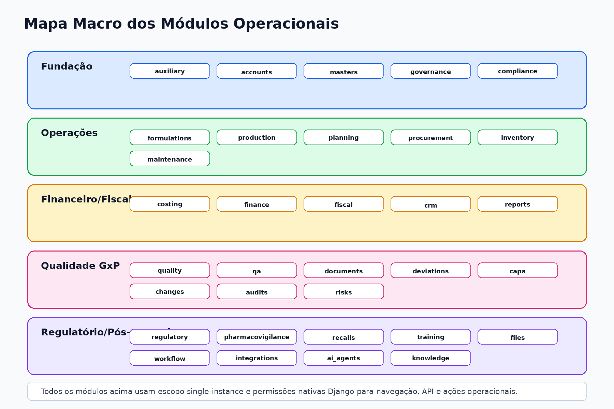

# RGN Farma System — Manual do Usuário

## Sumário

1. Identificação
2. Finalidade do sistema
3. Conceitos básicos
4. Acesso ao sistema
5. Saída segura
6. Tela inicial
7. Listas, criação, edição, exclusão e ações operacionais
8. Módulos operacionais
9. Boas práticas de uso
10. Mensagens comuns
11. Administração de usuários e permissões
12. Checklist diário do usuário
13. Suporte
14. Glossário

## Identificação

| Campo | Informação |
|---|---|
| Sistema | RGN Farma System |
| Documento | Manual do Usuário |
| Versão | 1.2 |
| Data | 28/07/2026 |
| Empresa desenvolvedora | RGN SYSTEMS TECNOLOGIA INOVA SIMPLES (I.S.) |
| CNPJ | 67.956.492/0001-64 |
| Endereço | Rua Doutor Joao Marques, 60, Ilha do Retiro — Recife/PE, CEP 50750-320 |

### Histórico de revisões

| Versão | Data | Alteração |
|---|---|---|
| 1.0 | 21/07/2026 | Emissão inicial do manual. |
| 1.1 | 27/07/2026 | Workspace de Produção, mapas, permissões por aba e liberação transacional de lote por QA. |
| 1.2 | 28/07/2026 | Uso do catálogo curado, filtros, exportações, execução agendada, downloads protegidos e tratamento de falhas. |

## Finalidade do sistema

O RGN Farma System é uma aplicação web para gestão integrada de processos da indústria farmacêutica. O sistema centraliza cadastros, produção, planejamento, compras, estoque, custos, financeiro, fiscal, CRM, controle de qualidade, garantia da qualidade, documentos, desvios, CAPA, mudanças, auditorias, riscos, regulatório, farmacovigilância, recalls, manutenção, treinamentos, workflow, relatórios, integrações, agentes de IA e base de conhecimento regulatória.

O objetivo é permitir que cada área registre suas atividades de forma padronizada, rastreável e controlada por permissões.

## Conceitos básicos

### Usuário

Cada pessoa acessa o sistema com um usuário individual. Não compartilhe usuário ou senha. Todas as ações relevantes podem ser associadas ao usuário logado.

### Permissões

O que aparece para você depende das permissões atribuídas pelo administrador. O sistema usa permissões como:

- visualizar;
- adicionar;
- alterar;
- excluir;
- executar ações especiais.

Se um menu, botão ou ação não aparecer, normalmente significa que seu perfil não possui permissão para aquela operação ou que o registro está em um status no qual a ação não é permitida.

### Módulo

Um módulo agrupa recursos de uma área de negócio. Exemplos: Produção, Estoque, Qualidade, Fiscal, Financeiro e Documentos.



### Recurso

Um recurso é uma tela de registros dentro de um módulo. Exemplos: Produtos, Ordens de Produção, Lotes, Amostras, Documentos Controlados e CAPAs.

### Ação operacional

Ação operacional é um botão que altera o ciclo de vida do registro. Exemplos: aprovar, liberar, iniciar, concluir, cancelar, publicar, bloquear, desbloquear ou gerar relatório.

## Acesso ao sistema

1. Abra o endereço informado pelo administrador.
2. Acesse a tela de login.
3. Informe seu nome de usuário.
4. Informe sua senha.
5. Clique em entrar.

Após login bem-sucedido, o sistema redireciona para `/app/`.

Se você não conseguir acessar:

- confirme se o usuário está correto;
- verifique se a senha está correta;
- aguarde se houver bloqueio temporário por várias tentativas;
- acione o administrador caso precise redefinir senha ou revisar permissões.

## Saída segura

Ao terminar o uso:

1. clique na opção de sair/logout;
2. feche o navegador se estiver em computador compartilhado;
3. nunca deixe sessão aberta em estação sem supervisão.

## Tela inicial

A tela inicial apresenta os módulos disponíveis para seu perfil. A ausência de um módulo não indica erro; indica falta de permissão de visualização para os recursos daquele módulo.

Use a sidebar para navegar entre áreas. A navegação foi desenhada para uso operacional diário; o Django Admin é reservado para administradores.

## Como trabalhar com listas

As telas de lista normalmente permitem:

- consultar registros;
- pesquisar por texto;
- filtrar por campos principais;
- ordenar resultados;
- abrir detalhe do registro;
- criar novo registro quando permitido;
- acessar visualizações alternativas quando existirem.

Boas práticas:

- use filtros antes de concluir que um registro não existe;
- revise status e datas;
- evite criar duplicidade de cadastros;
- use códigos e descrições padronizadas.

## Como criar um registro

1. Acesse o módulo.
2. Abra o recurso desejado.
3. Clique em criar/adicionar.
4. Preencha os campos obrigatórios.
5. Revise as informações.
6. Salve.

Se aparecer mensagem de validação, corrija os campos indicados e salve novamente.

## Como editar um registro

1. Abra a lista do recurso.
2. Localize o registro.
3. Abra a tela de detalhe ou edição.
4. Altere os campos permitidos.
5. Salve.

Alguns registros podem ficar bloqueados para edição após aprovação, publicação, fechamento, cancelamento ou por regra GxP.

## Como excluir um registro

A exclusão depende da permissão `delete` e das regras do módulo. Em áreas GxP, documentos, auditorias e trilhas, a exclusão pode estar bloqueada mesmo para usuários com permissão, porque a rastreabilidade deve ser preservada.

Quando a exclusão não estiver disponível, use ações de ciclo de vida como cancelar, arquivar, obsoletar, fechar ou inativar, se aplicável.

## Ações operacionais

Botões de ação aparecem conforme:

- sua permissão;
- o status atual do registro;
- as regras do processo;
- pendências obrigatórias.

Exemplos:

- uma ordem de produção pode ser aprovada antes de ser liberada;
- uma amostra precisa seguir coleta, recebimento, análise, revisão e aprovação;
- um documento pode ser submetido, revisado, aprovado, publicado e obsoleto;
- um desvio só pode ser encerrado se investigação, impacto e aprovações estiverem concluídos.

Se uma ação falhar, leia a mensagem exibida. Ela geralmente informa o pré-requisito não atendido.

## Módulos operacionais

### Cadastros auxiliares e dados mestres

Use para manter estruturas de apoio:

- unidades de medida;
- categorias;
- produtos e materiais;
- parceiros de negócio;
- sites;
- almoxarifados;
- localizações;
- catálogos e parâmetros auxiliares.

Esses cadastros alimentam quase todos os demais módulos. Preencha códigos e descrições com padronização.

### Formulações

Use para controlar:

- fórmulas mestras;
- componentes;
- perdas previstas;
- roteiros de fabricação;
- etapas produtivas.

Antes de liberar uso operacional, confirme versão, status, componentes e roteiro.

### Produção

Use para preparar, executar e rastrear ordens de produção. O fluxo recomendado
é:

1. crie a ordem e confira produto, fórmula, roteiro, quantidade e programação;
2. execute **Aprovar**;
3. na aba **Matérias-primas**, informe os lotes, endereços e quantidades e
   execute **Separar matérias-primas**;
4. execute **Liberar**;
5. execute **Iniciar**;
6. registre os apontamentos nas quatro abas e execute **Baixar
   matérias-primas**;
7. execute **Concluir** e informe o rendimento real;
8. execute **Receber produtos acabados**;
9. encaminhe o lote em quarentena ao fluxo de QA para a decisão de qualidade.

Produção recebe o produto acabado em quarentena, mas **não pode aprovar a
qualidade do lote**. A liberação é responsabilidade exclusiva de QA.

#### Workspace de execução

A tela **Executar** organiza os registros em quatro abas:

- **Matérias-primas**: planeje a alocação e informe consumo real, perda e
  devolução;
- **Produtos acabados**: cadastre o resultado pendente, lote, quantidade,
  destino e datas;
- **Processos**: registre etapas, equipamento, estado, início, fim e
  observações;
- **Colaboradores**: registre pessoa, função, processo, intervalo e custo-hora.

As quatro abas permanecem visíveis para que a organização da tela seja
previsível. Quando seu perfil não possuir permissão de consulta para uma aba,
ela mostrará um aviso e não consultará nem renderizará os registros daquela
área. Para criar ou alterar uma linha, você também precisa da permissão de
escrita do respectivo recurso. A aba com erro fica selecionada após uma
validação.

Não tente excluir evidências operacionais. Produtos já recebidos e processos
concluídos ou marcados como não executados são imutáveis. Para marcar um
processo como **Não executado**, primeiro registre-o como pendente e depois
informe a justificativa; o sistema associa o ator autenticado. Apontamentos de
colaboradores só podem ser alterados enquanto a ordem estiver liberada, em
execução ou pausada.

#### Separação, baixa e recebimento

Antes de separar, confirme que cada material tem lote aprovado, não vencido,
almoxarifado, localização e saldo suficiente. A separação cria a reserva.

Antes da baixa, informe para cada linha:

```text
consumo real + perda + devolução = quantidade reservada
```

A devolução libera a parte não consumida da reserva por um movimento próprio.
O recebimento do produto acabado exige a ordem concluída, resultado pendente,
destino informado e baixa dos componentes ativos da fórmula. O sistema cria o
lote de saída em quarentena e a genealogia dos lotes consumidos.

As ações **Separar matérias-primas**, **Baixar matérias-primas**, **Receber
produtos acabados** e **Calcular custo** são idempotentes: se a mesma ação já
foi concluída com evidência coerente, repeti-la retorna os mesmos registros sem
duplicar movimentos. As transições de estado, como Aprovar, Liberar ou
Cancelar, não funcionam assim: uma repetição fora do estado esperado é
rejeitada.

Se precisar cancelar, informe uma justificativa. O cancelamento só está
disponível antes da conclusão e não desfaz movimentos já postados. Nunca apague
nem altere diretamente um movimento postado. A correção deve preservar o
original e usar um novo movimento inverso ou ajuste, com justificativa e ator,
seguindo o procedimento interno autorizado.

> **Limitação atual:** ainda não existe uma ação de Produção que compense
> automaticamente movimentos postados. O ajuste de estoque disponível é
> genérico e não substitui um fluxo regulado de estorno da ordem. Em caso de
> divergência, interrompa a operação e solicite o tratamento controlado ao
> responsável por Estoque/Qualidade.

#### Mapas de controle e resultados

No detalhe da ordem, os links **Mapa de controle** e **Mapa de resultados**
aparecem para usuários com `production.view_productionorder` e
`production.view_production_maps`.

O mapa de controle reúne identificação, fórmula, roteiro, programação,
responsáveis, materiais/lotes, produtos acabados, processos, colaboradores,
movimentos, genealogia, custos, eventos e observações. O mapa de resultados
acrescenta rendimento, perda, retrabalho, devoluções, variações, tempos e
custos planejado, real e variação.

Cada seção possui permissão própria. Quando você não puder consultar uma área,
o mapa exibirá o aviso correspondente e não carregará seus dados. Use
**Imprimir mapa** para gerar a versão de impressão pelo navegador.

Registre perdas, devoluções, desvios e justificativas de forma completa. Toda
gravação da workspace e cada ação operacional relevante deixam trilha com ator
e data.

### Planejamento, MPS e MRP

Use para:

- políticas de planejamento;
- plano mestre de produção;
- posição de estoque;
- execução de MRP;
- sugestões de compra, produção, transferência ou terceirização;
- capacidade produtiva.

Antes de calcular MRP, revise demanda, estoque, lead time, lote mínimo, múltiplos e políticas.

### Compras

Use para:

- requisições;
- itens de requisição;
- cotações;
- propostas de fornecedores;
- qualificação de fornecedores;
- pedidos de compra;
- recebimentos.

Fluxo comum:

1. criar requisição;
2. submeter;
3. aprovar ou rejeitar;
4. cotar fornecedores;
5. emitir pedido;
6. registrar recebimento físico/fiscal/qualidade.

### Estoque

Use para:

- lotes e sublotes;
- saldos;
- movimentações;
- genealogia de lotes.

Registre entradas, saídas, transferências, ajustes, reservas, perdas, segregações, descartes e expedições com motivo apropriado. Em ambiente farmacêutico, lote, validade, origem e status de qualidade são informações críticas.

O status de qualidade de um lote e o status, a quantidade e a reserva de um
saldo não podem ser alterados nos formulários genéricos de Estoque. A API
também rejeita tentativas de enviar esses campos. Use as ações operacionais de
movimento, reserva e disposição de Qualidade/QA; não tente contornar o fluxo
por edição administrativa.

### Custos

Use para:

- centros de custo;
- elementos de custo;
- custos padrão;
- simulações;
- captura de custo real;
- fechamento mensal;
- snapshots de relatórios.

Recalcule e aprove custos conforme política da empresa. Fechamentos mensais devem ser revisados antes de execução.

### Financeiro

Use para:

- plano de contas;
- categorias financeiras;
- contas caixa/banco;
- títulos a pagar e receber;
- liquidações;
- fluxo de caixa;
- fechamento financeiro.

Antes de aprovar pagamentos, valide fornecedor, vencimento, valor, centro de custo e documentos vinculados.

### Fiscal

Use para:

- empresas fiscais;
- municípios;
- unidades fiscais;
- NCM;
- CFOP;
- situações e regras tributárias;
- documentos fiscais;
- itens e impostos;
- apurações;
- livros fiscais;
- obrigações;
- auditoria fiscal.

Ações especiais incluem revisão, aprovação, lançamento, emissão, consulta, cancelamento e envio por e-mail. Verifique ambiente fiscal, dados cadastrais, impostos e arquivos XML/DANFE.

### CRM

Use para:

- grupos de clientes;
- canais de venda;
- representantes;
- perfis de clientes;
- contatos;
- campanhas;
- oportunidades;
- propostas;
- contratos;
- pedidos de venda;
- interações;
- reclamações.

Reclamações podem se relacionar com qualidade, lote, pedido, nota fiscal, CAPA ou desvio. Registre fatos, datas, produto e lote quando disponíveis.

### Controle de Qualidade

Use para:

- especificações analíticas;
- amostras;
- análises;
- resultados;
- investigações laboratoriais;
- documentos de qualidade.

Fluxo típico de amostra:

1. criar amostra;
2. coletar;
3. receber;
4. iniciar análise;
5. revisar;
6. aprovar ou rejeitar.

Resultados OOS, OOT ou alerta devem ser tratados conforme procedimento interno.

### Garantia da Qualidade

Use para:

- revisões QA;
- checklist de batch record;
- liberação de lote;
- bloqueios de qualidade;
- treinamentos obrigatórios;
- regras de atividade crítica.

Liberações, rejeições, bloqueios e desbloqueios devem ser executados apenas por
usuários autorizados e com justificativa suficiente. **Aprovar**, **Bloquear**
e **Rejeitar** aparecem durante a revisão; quando bloqueada, a liberação pode
ser **Desbloqueada** ou **Rejeitada**. Aprovações e rejeições são terminais.
Cada decisão exige que a liberação, o lote, as evidências e todos os saldos
estejam coerentes, atualiza a disposição de todo o conjunto e registra o ator
e uma única auditoria na mesma transação.

Depois de criar a liberação, produto, lote, revisão QA, documento de qualidade
e ordem de produção não podem ser trocados. Crie uma liberação correta em vez
de tentar reaproveitar um registro para outro lote.

Se o sistema informar que existe disposição divergente entre lote e saldo,
não tente corrigir o status diretamente. Interrompa a liberação e solicite a
reconciliação controlada. Repetir uma liberação já concluída é rejeitado e não
gera uma segunda auditoria.

### Documentos controlados

Use para:

- documentos controlados;
- anexos;
- relacionamentos;
- aprovações;
- distribuições;
- trilha de auditoria.

Fluxo típico:

1. criar documento;
2. submeter;
3. revisar;
4. aprovar;
5. publicar;
6. distribuir;
7. registrar leitura;
8. criar revisão, obsoletar, cancelar ou arquivar quando aplicável.

Nunca substitua controle documental por arquivo solto fora do sistema quando o procedimento exigir rastreabilidade.

### Desvios

Use para:

- registrar desvios e não conformidades;
- anexar evidências;
- conduzir investigação;
- registrar avaliação de impacto;
- coletar aprovações;
- vincular CAPA, mudança, auditoria, reclamação, OOS/OOT, lote, documento ou risco.

Um desvio deve conter descrição objetiva, área, produto/lote quando aplicável, severidade, criticidade, impacto e conclusão.

### CAPA

Use para:

- registrar ações corretivas e preventivas;
- planejar ações;
- anexar evidências;
- avaliar eficácia;
- aprovar e encerrar;
- gerar notificações.

CAPA deve ter causa, plano, responsáveis, prazos, evidências e verificação de eficácia quando exigida.

### Controle de mudanças

Use para:

- registrar mudanças propostas;
- mapear áreas afetadas;
- avaliar impacto;
- planejar ações;
- aprovar;
- acompanhar implementação;
- encerrar.

Avalie impacto em validação, regulatório, treinamento, estoque, documentos, equipamentos, processos e sistemas.

### Auditorias

Use para:

- programas de auditoria;
- planos;
- checklists;
- achados;
- evidências;
- ações de follow-up;
- relatórios.

Achados devem ter evidência objetiva, classificação, responsável e prazo.

### Riscos

Use para:

- registrar riscos;
- avaliar score inicial e residual;
- definir controles;
- planejar mitigação;
- revisar periodicamente;
- gerar alertas.

Riscos devem ser avaliados com critérios consistentes e vinculados aos processos afetados.

### Assuntos regulatórios

Use para:

- produtos regulatórios;
- dossiês;
- registros;
- petições;
- exigências;
- compromissos;
- evidências;
- alertas;
- relatórios.

Controle prazos regulatórios, renovações, exigências, compromissos e evidências protocoladas.

### Farmacovigilância

Use para:

- casos de farmacovigilância;
- classificação;
- avaliação de causalidade;
- investigação;
- ações;
- relatórios de segurança.

Registre dados recebidos, datas, produto, lote, evento adverso, gravidade, causalidade e conclusão.

### Recalls e pós-mercado

Use para:

- reclamações de mercado;
- devoluções;
- campanhas de recall/recolhimento;
- clientes impactados;
- comunicações;
- relatórios de efetividade.

Campanhas devem registrar aprovação, início, comunicações, respostas, retornos e encerramento.

### Manutenção e calibração

Use para:

- ativos;
- planos;
- ordens;
- paradas;
- logs de uso;
- relatórios.

Bloqueie ativos quando houver restrição de uso. Registre evidências de execução, calibração e liberação.

### Treinamentos

Use para:

- cargos;
- funções;
- competências;
- requisitos;
- matriz;
- turmas;
- inscrições;
- atividades críticas;
- indicadores.

Atividades críticas podem exigir treinamento válido. Usuários sem treinamento aprovado podem ser impedidos de executar certas operações.

### Arquivos protegidos

Use para:

- anexos protegidos;
- regras de acesso;
- links seguros;
- auditoria de visualização/download.

Arquivos podem ser criptografados e ter acesso temporário controlado. Não compartilhe links fora do público autorizado.

### Relatórios

O catálogo reúne 15 relatórios de Financeiro, Fiscal, Estoque e
Rastreabilidade, Compras e Produção. Acesse **Relatórios > Catálogo** ou
`/app/reports/catalog/`. A lista mostra somente relatórios ativos autorizados
para o seu perfil; não aparecer na lista não significa que o relatório foi
apagado.

Para gerar um relatório:

1. Confirme o ambiente e acesse o catálogo com seu usuário individual.
2. Localize o relatório pelo código e título, dentro da área correspondente.
3. Abra **Executar**. Se o botão não aparecer, solicite as permissões de
   consulta do domínio e execução de relatório.
4. Preencha os filtros obrigatórios. Data inicial/final usam data; produto,
   cliente e fornecedor usam identificador inteiro; situação e lote usam
   texto. Não informe filtros fora do formulário.
5. Em campos de escolha, selecione uma opção explicitamente quando o campo for
   obrigatório; deixe a opção vazia quando um campo opcional não se aplicar.
6. Selecione PDF, XLSX ou CSV e revise período, entidade e formato.
7. Clique em **Gerar relatório**. A execução direta processa a solicitação e
   redireciona para o download protegido quando concluída.
8. Guarde o número `REP-...` para suporte e auditoria. Nunca copie ou solicite
   caminhos internos de storage.

Os estados da execução são:

| Estado | Significado | Conduta |
|---|---|---|
| Pendente (`pending`) | Aguardando processamento inicial ou redisparo | Confirme a origem: somente o caminho Celery faz retry automático; UI/API direta exige redisparo explícito e autorizado |
| Executando (`running`) | Um worker possui o lease da execução | Aguarde; outra tentativa será recusada enquanto o lease estiver válido |
| Concluído (`completed`) | Arquivo protegido e hash foram registrados | Baixe pela ação autorizada e valide o conteúdo |
| Falhou (`failed`) | Erro definitivo ou retries esgotados | Consulte mensagem pública, número da execução, logs e auditoria autorizados |
| Cancelado (`cancelled`) | Execução interrompida | Gere uma nova execução somente se a necessidade continuar válida |

#### Filtros e resultados

- O formulário é a fonte dos filtros permitidos; nomes técnicos, SQL, caminhos
  de model ou expressões não são aceitos.
- Data final não pode ser anterior à inicial.
- Filtros obrigatórios variam por relatório. O catálogo técnico em
  **Relatórios e BI** documenta a matriz completa dos 15 códigos.
- CSV é indicado para intercâmbio tabular, XLSX para análise em planilha e PDF
  para leitura/distribuição controlada.
- Revise o total de linhas e o conteúdo antes de usar o resultado em decisão,
  divulgação ou evidência regulada.

#### Agendamentos e notificações

Agendamentos registram definição, filtros, formato, frequência, próxima
execução, proprietário e destinatários. Somente usuários autorizados devem
criá-los ou dispará-los.

- A ação REST **trigger_now** executa imediatamente.
- O caminho assíncrono é usado quando o serviço de agendamento é chamado sem
  execução imediata: uma task Celery é enviada e seu ID fica na execução. Esse
  é o único caminho que agenda retry automático para falha recuperável.
- O módulo atual não procura automaticamente agendamentos cujo
  `next_run_at` venceu. A expressão de frequência cron é obrigatória no
  cadastro, mas não é interpretada pelo cálculo atual, que avança um dia.
  Portanto, a operação automática depende de uma orquestração aprovada que
  invoque o disparo; confirme esse componente no ambiente antes da
  homologação.
- Após conclusão agendada, `last_run_at` e `next_run_at` são atualizados.
- Os destinatários recebem notificação interna; sem destinatários, a
  notificação vai ao solicitante. Falha de notificação não invalida um arquivo
  já concluído e deve ser investigada separadamente.

#### Download e segurança

O arquivo de resultado é criptografado com AES-256-GCM e possui hash SHA-256.
Somente execução concluída, arquivo ativo e usuário com permissões de execução
e arquivo permitem download. O sistema não mostra o caminho interno do
storage, impede cache persistente/compartilhado e audita downloads e negações
com os eventos diretos do arquivo protegido e metadados do acesso. A auditoria
funcional do lifecycle da execução é best-effort: uma falha de gravação é
registrada no log e não reverte o processamento. O sistema não possui outbox
nem replay automático para reconstruir esse evento; a operação deve monitorar
e reconciliar a ocorrência.

Não encaminhe links, arquivos ou exportações fora do público autorizado. Para
evidência crítica, registre o número da execução, código do relatório, filtros,
formato, data/hora e hash exibido por uma consulta autorizada.

### Workflow

Use para:

- notificações;
- filas de aprovação;
- tarefas;
- delegações;
- comentários;
- anexos;
- jobs assíncronos;
- histórico.

Use comentários e anexos para registrar contexto de decisão.

### Integrações

Use para:

- conectores;
- clientes de API;
- logs de chamadas;
- eventos.

Somente usuários autorizados devem ativar, suspender, testar ou rotacionar segredos de integração.

### Agentes de IA

Use para:

- perfis de agentes;
- execuções;
- sugestões;
- auditoria de prompts.

Sugestões de IA devem passar por revisão humana antes de aplicação quando o processo exigir decisão regulada.

### Base de conhecimento regulatória

Use para:

- consultar fontes;
- documentos;
- chunks;
- sessões;
- mensagens;
- logs de ingestão;
- chat RAG.

O widget do assistente aparece apenas para usuários com a permissão
`knowledge.view_ragchatsession`. Digite uma pergunta sobre o uso do ERP e use
“Nova conversa” quando quiser encerrar o contexto atual. As conversas possuem
isolamento por usuário: você não pode consultar ou continuar a sessão de outra
pessoa.

O chat funciona em modo **somente leitura**. Ele consulta o manual elegível,
mantém histórico e apresenta citações quando encontra contexto, mas não altera
cadastros, não executa SQL e não confirma ações ou workflows. Se a recuperação
vetorial estiver indisponível, o sistema pode usar fallback PostgreSQL sem
ampliar o conjunto de fontes permitidas.

As respostas devem ser usadas como apoio. Confira as citações e considere
fontes oficiais, procedimentos internos e revisão humana qualificada antes de
qualquer decisão regulatória. Se o widget não estiver visível, solicite ao
administrador a revisão da permissão funcional; não compartilhe sua sessão ou
credenciais com outro usuário.

## Boas práticas de uso

- Use seu usuário individual.
- Registre dados no momento da execução sempre que possível.
- Não use campos de observação para substituir campos estruturados.
- Preencha justificativas em ações críticas.
- Anexe evidências quando o processo exigir.
- Revise produto, lote, versão, status e datas antes de aprovar.
- Não tente contornar fluxos de aprovação.
- Comunique erro de cadastro ao administrador em vez de criar duplicidade.
- Use relatórios como apoio, mas valide filtros e período.

## Mensagens comuns

| Mensagem/Situação | Significado provável | Ação recomendada |
|---|---|---|
| Permissão negada | Seu perfil não tem autorização | Solicitar revisão ao gestor/administrador |
| Campo obrigatório | Informação essencial não preenchida | Preencher o campo indicado |
| Status inválido para ação | O registro não está no estágio correto | Verificar fluxo e pendências |
| Registro não encontrado | Filtro incorreto ou sem permissão | Remover filtros ou confirmar acesso |
| Muitas tentativas de login | Bloqueio temporário de segurança | Aguardar janela de liberação |
| Arquivo não disponível | Link expirado, falta permissão ou arquivo removido | Solicitar novo link ou permissão |
| Relatório não aparece no catálogo | Definição inativa ou falta da permissão do domínio | Confirmar código e solicitar revisão de acesso ao administrador |
| Usuário sem permissão para executar relatórios | Falta permissão de consulta, criação de execução ou domínio | Solicitar o conjunto de permissões ao gestor/administrador |
| Esquema de filtros indisponível | Configuração do relatório gerenciado está inválida | Não contornar o formulário; informar código do relatório ao suporte |
| Filtro obrigatório ou escolha inválida | Campo vazio, tipo incorreto ou valor fora das opções | Corrigir o campo indicado e reenviar |
| A execução do relatório já está em andamento | Outro processo mantém o lease da mesma execução | Aguardar; não criar cópias para contornar o processamento |
| Falha recuperável na execução direta | UI/API síncrona encontrou `ConnectionError`, `TimeoutError` ou `OSError`; a execução voltou a `pending` | Registrar o número, corrigir a causa e solicitar redisparo explícito e autorizado; não há retry automático nesse caminho |
| Falha recuperável no Celery | A task encontrou `ConnectionError`, `TimeoutError` ou `OSError` | Aguardar o retry automático e verificar worker, RabbitMQ, rede e storage |
| Erro de banco de dados | Uma exceção Django de banco ocorreu, sem classificação automática como recuperável | Registrar o número e acionar suporte para triagem; não presumir retry apenas pela origem no banco |
| Falha recuperável no Celery após esgotar as tentativas | O limite de retries automáticos foi alcançado | Registrar número da execução e acionar suporte para análise de logs/auditoria |
| Falha de validação ou falha interna | A execução terminou em `failed` com mensagem pública segura | Verificar dados de origem; suporte autorizado consulta detalhes técnicos |
| Agendamento não iniciou no horário | Não há dispatcher periódico embutido ou a orquestração está indisponível | Confirmar `next_run_at`, worker/broker e o disparador aprovado |
| Notificação não recebida | Destinatário ausente ou envio interno falhou após a conclusão | Confirmar o status da execução e consultar destinatários/auditoria |
| Falha ao registrar auditoria do relatório | O evento funcional de lifecycle não foi gravado, mas o processamento continuou | Monitorar o log/alerta, abrir desvio ou incidente e reconciliar a evidência; não há replay automático |

## Administração de usuários e permissões

A administração de usuários, grupos e permissões é feita pelo Django Admin. Usuários operacionais comuns não devem acessar o Admin, salvo quando possuírem atribuição administrativa.

Responsabilidades do administrador:

- criar usuários;
- ativar/inativar usuários;
- definir grupos;
- atribuir permissões;
- revisar acessos periodicamente;
- remover acessos de usuários desligados;
- auditar perfis privilegiados.

## Checklist diário do usuário

Antes de iniciar:

- confirme que está no ambiente correto;
- verifique se está usando seu usuário;
- confira pendências no workflow;
- revise notificações;
- filtre registros por data/status quando necessário.

Antes de aprovar ou concluir:

- revise dados obrigatórios;
- confirme anexos e evidências;
- confirme lote/produto/documento relacionado;
- verifique impacto regulatório/GxP;
- leia mensagens de validação;
- registre justificativa quando solicitada.

Ao encerrar o dia:

- finalize registros em andamento;
- não deixe tela aberta em computador compartilhado;
- saia do sistema.

## Suporte

Para problemas de acesso, permissões, erro em tela, lentidão ou dúvida funcional, acione o responsável interno pelo sistema ou a equipe de suporte definida pela organização.

Ao abrir um chamado, informe:

- usuário;
- data e horário;
- módulo;
- tela/recurso;
- ação executada;
- mensagem exibida;
- código ou identificador do registro;
- evidência em imagem, se permitido pela política interna.

## Glossário

| Termo | Significado |
|---|---|
| API | Interface técnica usada para integração entre sistemas |
| CAPA | Ação Corretiva e Preventiva |
| GxP | Boas práticas aplicáveis a ambientes regulados |
| MRP | Planejamento de necessidades de materiais |
| MPS | Plano mestre de produção |
| OOS | Resultado fora de especificação |
| OOT | Resultado fora de tendência |
| QA | Garantia da Qualidade |
| QC | Controle de Qualidade |
| RAG | Recuperação de informação para apoio a respostas de IA |
| Workflow | Fluxo de tarefas, aprovações e notificações |
