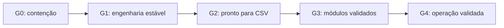
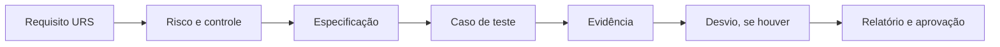

# Programa de Prontidão CSV e Validação GxP

## 1. Objetivo

Eliminar os riscos técnicos e regulatórios identificados no RGN Farma System e conduzir o produto por duas etapas sucessivas:

1. prontidão formal para iniciar Computerized System Validation (CSV);
2. conclusão de IQ/OQ/PQ e entrada em operação GxP validada.

O programa adota GAMP 5, ICH Q9, ALCOA+, BPF/GMP, PIC/S e requisitos aplicáveis da ANVISA como referências. A aplicabilidade normativa detalhada será confirmada e aprovada por Qualidade e Assuntos Regulatórios durante a avaliação de risco.

## 2. Estratégia escolhida

O programa será incremental e baseado em risco. A fundação técnica e os controles transversais serão estabilizados antes da validação dos módulos. Os módulos serão validados em ondas, priorizando identidade, integridade de dados, documentos, qualidade, lotes e estoque.

Foram rejeitadas:

- validação de todo o ERP em uma única liberação, devido ao risco de ciclo longo e retrabalho;
- validação predominantemente documental sem amadurecimento de engenharia, por produzir evidências frágeis e não demonstrar controle efetivo.

## 3. Escopo

O escopo inclui:

- contenção e remediação de segredos expostos;
- segurança, ambientes, CI/CD, deploy, observabilidade e continuidade;
- isolamento entre tenants, RBAC, MFA e segregação de funções;
- assinatura eletrônica, trilha de auditoria e integridade de registros;
- documentos e evidências de CSV;
- IQ/OQ/PQ dos módulos no uso pretendido aprovado;
- procedimentos operacionais, treinamento, revisão periódica e revalidação;
- fornecedores, serviços externos, integrações e recursos de IA.

O programa não presume que a existência de uma funcionalidade equivale à sua validação. A aceitação regulatória dependerá de evidência aprovada para o uso pretendido.

## 4. Governança e responsabilidades

| Papel | Responsabilidade |
|---|---|
| Patrocinador executivo | Aceitar risco residual e autorizar produção |
| Product Owner | Aprovar requisitos e critérios funcionais |
| Qualidade/Validação | Aprovar estratégia CSV, riscos, protocolos, desvios e relatórios |
| Engenharia | Implementar controles, testes e correções |
| Segurança/DPO | Gerir acessos, segredos, incidentes, LGPD e fornecedores |
| Infraestrutura/Operações | Executar qualificação, backup, restauração, monitoramento e continuidade |
| Usuários-chave | Executar e aprovar UAT/PQ dos processos sob sua responsabilidade |

Qualidade possui autoridade para interromper uma liberação quando os critérios de gate não forem atendidos.

## 5. Gates do programa

### G0 — Contenção

- todos os segredos expostos foram inventariados, revogados e rotacionados;
- os artefatos foram removidos do índice e do histórico Git;
- o período de exposição e os logs de acesso foram avaliados;
- o incidente e seu impacto foram formalmente registrados;
- secret scanning preventivo está ativo.

### G1 — Engenharia estável

- DEV, TEST/VALIDATION e PROD estão segregados;
- o mesmo commit produz artefato versionado e reproduzível;
- pipeline obrigatória executa checks, migrations, testes, cobertura, lint, tipos, SAST, dependências e validação OpenAPI;
- imagens e dependências estão fixadas;
- deploy, rollback, logs, métricas e alertas estão demonstrados;
- a decisão Nginx versus Traefik está formalmente aprovada e documentada.

### G2 — Pronto para CSV

- inventário e classificação GxP estão aprovados;
- Plano Mestre de Validação, URS, especificações e avaliação de risco estão aprovados;
- matriz de rastreabilidade cobre os requisitos do escopo;
- protocolos, dados de teste, gestão de desvios e SOPs estão vigentes;
- fornecedores e componentes de terceiros foram avaliados;
- Qualidade autorizou formalmente IQ/OQ/PQ.

### G3 — Módulos validados

- IQ/OQ/PQ do escopo foram executados e aprovados;
- requisitos críticos possuem evidência aprovada;
- não existem desvios críticos ou maiores abertos;
- riscos residuais possuem aceitação formal;
- relatório de validação autoriza o uso pretendido.

### G4 — Operação validada

- monitoramento, revisão periódica, gestão de mudanças e revalidação estão ativos;
- acessos são recertificados;
- backup, restauração e continuidade são exercitados periodicamente;
- treinamento e SOPs permanecem vigentes;
- evidências são retidas pelo prazo aprovado.

Nenhum gate aceita vulnerabilidade crítica, teste mandatório reprovado, desvio crítico aberto ou evidência sem aprovação.

## 6. Ondas de trabalho

### Onda 0 — Contenção imediata

1. inventariar segredos em arquivos, histórico, imagens, logs e ambientes;
2. revogar e rotacionar OAuth, banco, RabbitMQ, e-mail, APIs de IA, túnel, backup e criptografia;
3. remover `.env.backup*`, credenciais Playwright e demais artefatos sensíveis do Git;
4. ativar secret scanning local, em CI e no servidor Git;
5. investigar acessos durante o período de exposição;
6. registrar incidente, impacto e CAPA quando aplicável.

### Onda 1 — Fundação de engenharia

1. separar configurações de desenvolvimento, teste e produção;
2. criar CI com PostgreSQL, Redis e RabbitMQ reais;
3. estabelecer quality gates e cobertura por criticidade;
4. corrigir checks de deploy e avisos do schema OpenAPI;
5. fixar versões e executar containers sem privilégios;
6. padronizar proxy, TLS, HSTS, cookies, headers e gestão de segredos;
7. automatizar artefato imutável, deploy, rollback e identificação de versão;
8. implantar logs, métricas, alertas e trilha de mudanças operacionais.

### Onda 2 — Controles GxP transversais

1. RBAC, menor privilégio e segregação de funções;
2. MFA, bloqueio de conta, expiração de sessão e reautenticação em ações críticas;
3. assinatura eletrônica vinculada ao registro, significado, identidade e timestamp;
4. trilha de auditoria imutável, pesquisável, exportável e protegida;
5. motivo obrigatório para alteração de dados críticos;
6. sincronização temporal e registro consistente de timezone;
7. versionamento, hash, retenção e descarte controlado de documentos;
8. criptografia e ciclo de vida das chaves;
9. backup, restauração, RPO, RTO e disaster recovery demonstrados;
10. proibição de exclusão física de registros regulados;
11. recertificação de acessos e monitoramento de eventos críticos;
12. testes adversariais de isolamento entre tenants.

### Onda 3 — Pacote de prontidão CSV

Produzir e aprovar:

- Plano Mestre de Validação;
- inventário e classificação GxP;
- definição de uso pretendido e URS por processo;
- especificação funcional, técnica e de configuração;
- avaliação de risco GAMP 5/ICH Q9;
- matriz de rastreabilidade bidirecional;
- plano de testes e procedimento de desvios;
- SOPs de acesso, mudança, incidente, backup, restauração, continuidade, treinamento, revisão periódica e desativação;
- avaliação de fornecedores e componentes;
- plano de migração, reconciliação e aceitação de dados.

### Onda 4 — Validação incremental

Os grupos serão qualificados nesta ordem:

1. plataforma, identidade, tenants e permissões;
2. auditoria, workflow, arquivos e documentos;
3. cadastros mestres e treinamento;
4. estoque, lotes e genealogia;
5. QC, QA, desvios, CAPA, mudanças, riscos e auditorias;
6. produção, formulações, PCP/MRP e manutenção;
7. regulatório, farmacovigilância e recall;
8. compras, fiscal, financeiro, custos, CRM, integrações e IA.

Cada grupo terá protocolos e relatórios IQ/OQ/PQ independentes. Um grupo posterior pode iniciar preparação, mas não pode executar PQ se depender de controle transversal ainda não aprovado.

Integrações e IA exigem avaliação específica de disponibilidade, determinismo, proveniência, rastreabilidade, supervisão humana, falha segura e risco de resultado incorreto. Saídas de IA não podem tomar decisão GxP autônoma sem validação e autorização específicas.

### Onda 5 — Operação validada

1. liberar cada versão e escopo formalmente;
2. monitorar controles e eventos críticos;
3. realizar revisão periódica baseada em risco;
4. avaliar impacto e revalidar mudanças relevantes;
5. testar restauração e continuidade periodicamente;
6. recertificar acessos e manter treinamento;
7. acompanhar incidentes, desvios, CAPAs e eficácia;
8. arquivar evidências com retenção aprovada.

## 7. Rastreabilidade e fluxo de evidência

Cada requisito possuirá identificador estável e manterá o seguinte encadeamento:

A rastreabilidade será bidirecional: todo requisito aponta para risco, especificação e teste; todo teste e componente regulado aponta para um requisito aprovado.

Cada evidência conterá versão/commit, ambiente, configuração, executor, aprovador, data/hora sincronizada, entrada, resultado esperado, resultado obtido, artefatos, status e desvios relacionados. Evidências não serão sobrescritas; uma correção gera nova execução ligada à anterior.

## 8. Estratégia de testes

- testes unitários para validações, cálculos, workflows e invariantes;
- testes de integração para PostgreSQL, Redis, RabbitMQ, Celery, armazenamento, e-mail e APIs;
- testes sistemáticos de isolamento entre tenants;
- testes de autenticação, autorização, sessão, CSRF, uploads, criptografia e abuso;
- testes positivos e negativos de audit trail, assinatura, autoria, timestamp, motivo, retenção e imutabilidade;
- OQ cobrindo limites, exceções, concorrência, falhas e recuperação;
- PQ/UAT com cenários reais e dados representativos executados por usuários-chave;
- testes operacionais de deploy, rollback, backup, restauração, RPO, RTO e indisponibilidade.

Dados de teste serão sintéticos ou anonimizados. O ambiente de validação não compartilhará credenciais, filas, buckets ou bases com produção.

## 9. Gestão de desvios e risco residual

- **Crítico:** risco à segurança do paciente, integridade de dados ou isolamento entre tenants; bloqueia o gate.
- **Maior:** requisito GxP não atendido sem controle compensatório aprovado; bloqueia o módulo.
- **Menor:** não compromete o uso pretendido; admite aceitação formal com justificativa, responsável e prazo.

Todo desvio registrará causa raiz, impacto, correção, CAPA quando aplicável, reteste e aprovação de Qualidade. Apenas os papéis designados no Plano Mestre de Validação podem aceitar risco residual.

## 10. Critérios de liberação

- 100% dos requisitos críticos testados e aprovados;
- 100% da rastreabilidade dos requisitos críticos completa;
- nenhum desvio crítico ou maior aberto;
- pipeline e testes mandatórios aprovados para o artefato liberado;
- PQ/UAT aprovado pelos donos de processo;
- backup e restauração demonstrados no ambiente qualificado;
- usuários treinados antes da concessão de acesso;
- SOPs vigentes;
- riscos residuais aceitos;
- relatório de validação aprovado por Qualidade e patrocinador.

## 11. Cronograma e capacidade

| Período | Entrega | Gate |
|---|---|---|
| Semanas 1–2 | Contenção e incidente | G0 |
| Semanas 2–8 | CI/CD, ambientes, segurança e deploy | G1 |
| Semanas 5–14 | Controles GxP transversais | G1/G2 |
| Semanas 8–16 | Documentação e prontidão CSV | G2 |
| Meses 4–6 | Plataforma, documentos, mestres, estoque e qualidade | G3 parcial |
| Meses 6–9 | Produção, planejamento, regulatório e pós-mercado | G3 |
| Meses 8–11 | Áreas administrativas, integrações e IA | G3 |
| Meses 10–12 | Consolidação e operação validada | G4 |

Capacidade mínima recomendada:

- um líder técnico Django;
- dois a quatro desenvolvedores;
- um engenheiro de qualidade/testes;
- um responsável DevSecOps;
- um especialista CSV/QA;
- usuários-chave parciais por domínio;
- apoio de segurança, infraestrutura e proteção de dados.

Uma redução de capacidade aumenta o prazo ou reduz o escopo de cada onda; não reduz os controles nem as evidências obrigatórias.

## 12. Indicadores

- percentual de segredos rotacionados e revogados;
- vulnerabilidades abertas por severidade e idade;
- cobertura automatizada por criticidade;
- percentual de requisitos com rastreabilidade completa;
- controles críticos aprovados;
- desvios por severidade e tempo de fechamento;
- módulos aprovados em cada gate;
- sucesso dos exercícios de backup e restauração;
- percentual de acessos recertificados;
- percentual de usuários treinados;
- mudanças submetidas a avaliação de impacto e revalidação.

## 13. Definição de conclusão

O programa termina somente quando o uso pretendido aprovado estiver validado, os controles operacionais estiverem ativos e as evidências permitirem reconstruir quem realizou cada ação, quando, por qual motivo, em qual versão e com qual resultado. Funcionalidades ou módulos fora do uso pretendido aprovado permanecem explicitamente fora do estado validado.
