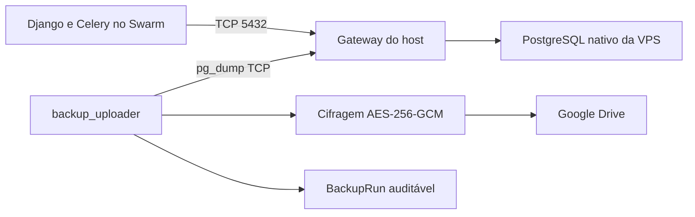

# PostgreSQL nativo na VPS

## Objetivo

Remover o PostgreSQL da stack Docker Swarm de produção e conectar o RGN Farma
System ao serviço PostgreSQL instalado diretamente na VPS, preservando o fluxo
diário de backup, cifragem, envio ao Google Drive, retenção, restauração e
evidências auditáveis.

## Escopo

- Produção em Docker Swarm definida por `docker-stack.yml`.
- Aplicação Django, Celery worker, Celery beat e `backup_uploader` permanecem em
  containers.
- Redis e RabbitMQ permanecem na stack.
- PostgreSQL passa a ser administrado pelo sistema operacional da VPS.
- O banco e o usuário serão exclusivos do ERP e terão o nome
  `rgnfarmasystem`.
- A senha aprovada será mantida somente no `.env` local e na configuração do
  PostgreSQL da VPS; ela não será registrada em arquivos versionados.
- O `docker-compose.yml` de desenvolvimento local continuará oferecendo seu
  PostgreSQL em container.

## Arquitetura

Os serviços da stack que usam Django ou acessam o banco diretamente resolverão
`host.docker.internal` por meio do gateway do host Docker. A variável
`DATABASE_URL` apontará para
`postgresql://<usuario>:<senha>@host.docker.internal:5432/<banco>`, com os
valores reais mantidos apenas no `.env` da VPS.

O serviço `db` e o volume `postgres_data` serão removidos exclusivamente de
`docker-stack.yml`. O PostgreSQL nativo deverá escutar na interface alcançável
pelos containers e o `pg_hba.conf` permitirá somente o usuário, banco e faixa
Docker necessários. A porta 5432 não deverá ser exposta publicamente pelo
firewall.

## Provisionamento e migração

O runbook orientará a criar o papel e o banco exclusivos no PostgreSQL nativo,
sem registrar a senha no histórico do shell. Antes da mudança, será produzido
um dump consistente do banco atual. O dump será restaurado no banco nativo e
validado antes de remover o serviço `db` da stack.

A transição seguirá esta ordem:

1. Produzir e verificar backup do PostgreSQL atual e da mídia.
2. Criar usuário e banco exclusivos no PostgreSQL nativo.
3. Configurar `listen_addresses`, `pg_hba.conf` e firewall com acesso mínimo.
4. Restaurar o dump no banco nativo.
5. Atualizar o `.env` ignorado pelo Git.
6. Implantar a stack sem o serviço `db` e sem `postgres_data`.
7. Executar migrations com lock e validar aplicação e workers.
8. Executar um backup manual, confirmar cifragem/upload e registrar evidência.
9. Exercitar o restore em ambiente isolado antes de considerar a migração
   concluída.

O volume antigo não será removido durante a implantação. Sua exclusão será uma
atividade manual posterior, condicionada à validação do novo banco e dos
backups.

## Backup e Google Drive

`scripts/backup.sh` ganhará um modo explícito de acesso direto ao PostgreSQL
por `DB_HOST`, `DB_PORT`, `POSTGRES_DB`, `POSTGRES_USER` e
`POSTGRES_PASSWORD`. A detecção de um socket Docker não deverá forçar a busca
por um container de banco quando a arquitetura estiver configurada como banco
externo.

O `backup_uploader` continuará:

- executando na janela diária configurada;
- gerando `postgres-*.sql.gz` e `media-*.tar.gz`;
- cifrando os artefatos com AES-256-GCM;
- gerando sidecar SHA-256;
- enviando ao Google Drive;
- registrando cada upload em `auxiliary.BackupRun`;
- aplicando retenção local e remota.

O diretório/volume de backups e os secrets do Google Drive não serão alterados.

## Restauração

`scripts/restore.sh` será compatível com dois alvos:

- PostgreSQL em container, preservado para desenvolvimento e compatibilidade;
- PostgreSQL externo/nativo, usando `psql` diretamente por TCP.

O modo será selecionado por configuração explícita, sem depender somente da
presença do Docker. Permanecem obrigatórios o `--dry-run`, a confirmação
`--yes`, o backup `pre-restore`, a decifragem e validação SHA-256 e a recriação
controlada do schema `public`.

## Tratamento de erros e segurança

- Falhas de DNS, autenticação, `pg_dump`, `psql`, compactação ou upload
  encerrarão o ciclo com código diferente de zero e log operacional.
- Dumps incompletos serão removidos ou não serão elegíveis para upload.
- Senhas não serão impressas em logs, documentos ou comandos sugeridos.
- `pg_hba.conf` usará autenticação SCRAM e regra restrita à faixa Docker.
- O firewall bloqueará 5432 para a Internet.
- O usuário da aplicação não será superusuário e não poderá criar papéis ou
  bancos.
- A conexão continuará configurada exclusivamente por variáveis de ambiente.

## Testes e verificações

- Testes de shell cobrirão seleção do modo externo, comandos de backup e
  restore, falhas de conexão e `--dry-run`.
- A configuração da stack será validada após remover `db` e `postgres_data`.
- `manage.py check` e `makemigrations --check --dry-run` continuarão passando.
- Os testes existentes de backup, restauração e prontidão serão executados.
- Na VPS serão validados `pg_isready`, migrations, healthcheck HTTP, Celery,
  backup manual, upload ao Drive e registro `BackupRun`.
- Um restore de teste deverá comprovar a legibilidade do artefato enviado.

## Documentação afetada

- `.env.example`, sem credenciais reais.
- `docs/DEPLOY_VPS.md`.
- `docs/deployment.md`.
- `docs/architecture/backup-restore.md`.
- README, se os comandos resumidos divergirem do novo fluxo.

## Critérios de aceitação

- A stack de produção não cria nem depende de um container PostgreSQL.
- Django e Celery conectam ao PostgreSQL nativo pelo gateway do host.
- O `.env` local contém os dados aprovados e permanece ignorado pelo Git.
- Backup diário, mídia, cifragem, SHA-256, Google Drive, retenção e
  `BackupRun` permanecem operacionais.
- Backup e restore suportam explicitamente PostgreSQL externo.
- A porta 5432 não fica exposta publicamente.
- O volume PostgreSQL antigo é preservado até aprovação de descarte.
- Testes relevantes e verificações operacionais passam sem pendências.
