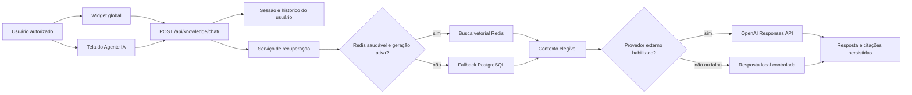

# Incorporação do Chat RAG Global Somente Leitura — Design

## 1. Contexto

O projeto de origem, localizado em
`/mnt/2c8d19a3-3bbb-4f90-b09f-9e17c780ce6a/Projects/rgnfarmasystem`, possui um
subsistema completo de conhecimento e chat RAG no app Django `knowledge`. Esse
subsistema mantém fontes, documentos, chunks, gerações de índice, sessões,
mensagens, citações, logs de ingestão, recuperação por Redis/PostgreSQL e uma
interface global e dedicada.

O projeto atual contém `templates/app/resource_chat.html` e
`static/js/rag-chat.js`, mas não contém o app `knowledge` nem registra
`/api/knowledge/`. A tela existente, portanto, aponta para um endpoint ausente.
Ela também anuncia capacidades como SQL, CAPA e Ishikawa que não possuem
implementação conversacional correspondente.

A origem usa Django 5.2 e inclui ações governadas capazes de propor mutações no
ERP. O projeto atual usa Django 6. A incorporação será adaptada aos contratos e
versões atuais, sem copiar cegamente arquivos compartilhados ou o histórico de
migrations da origem.

## 2. Decisões aprovadas

- incorporar o chat RAG completo, incluindo widget global e tela dedicada;
- manter o assistente estritamente somente leitura;
- não transportar modelos, políticas, endpoints ou executores de ações
  mutáveis;
- reutilizar o domínio RAG endurecido da origem, adaptando-o ao Django 6 e à
  arquitetura atual;
- exigir autorização funcional tanto na interface quanto no servidor;
- manter funcionamento degradado quando Redis ou provedor externo estiverem
  indisponíveis.

## 3. Objetivo

Disponibilizar um assistente RAG global e auditável que responda com base no
corpus autorizado do ERP, mantenha histórico e citações por usuário e continue
operacional em modo degradado, sem modificar dados de negócio.

## 4. Escopo

### Incluído

- novo app Django `knowledge` somente leitura;
- fontes, documentos, chunks e gerações de índice;
- sessões, mensagens, citações e logs de ingestão;
- endpoint autenticado `POST /api/knowledge/chat/`;
- APIs administrativas de consulta do domínio de conhecimento;
- widget flutuante nas páginas autenticadas autorizadas;
- tela dedicada dos perfis de Agentes IA;
- histórico persistente e isolado por usuário;
- recuperação vetorial por Redis/RediSearch;
- fallback de recuperação no PostgreSQL;
- respostas por OpenAI quando configurado;
- resposta local controlada quando o provedor externo estiver indisponível ou
  desabilitado;
- ingestão explícita do manual do ERP e reconstrução explícita do índice;
- permissões, administração Django, logs, testes e documentação operacional.

### Não incluído

- criação ou alteração de fórmulas pelo chat;
- qualquer ação mutável do ERP;
- SQL arbitrário ou ferramenta genérica de consulta ao banco;
- geração ou alteração de CAPA, Ishikawa, desvios ou outros registros GxP;
- transporte de `knowledge.actions`, políticas de ferramentas, nonces de
  confirmação ou tabelas de execução;
- ingestão automática durante requisições web;
- exposição de dados fora das fontes explicitamente elegíveis;
- substituição dos demais provedores e recursos de IA já existentes no projeto.

## 5. Arquitetura



O widget global e a página dedicada usarão o mesmo cliente JavaScript e o
mesmo contrato HTTP. A página dedicada deverá suprimir o widget global para
evitar duas instâncias concorrentes na mesma página.

## 6. Modelo de dados

O app conterá somente os modelos necessários ao fluxo de leitura:

### `KnowledgeSource`

Catálogo de fontes autorizadas, com código, título, tipo, publicador, versão,
URL, situação, indicação de oficialidade e elegibilidade para o chat.

### `KnowledgeDocument`

Documento versionado pertencente a uma fonte, com hash de conteúdo, texto
extraído, situação da ingestão, metadados e eventual erro de processamento.

### `KnowledgeChunk`

Trecho recuperável de um documento, com referência de seção/página, conteúdo,
hash, contagem de tokens, vetor persistido e metadados.

### `KnowledgeIndexGeneration`

Manifesto de uma geração de índice Redis. Somente uma geração poderá estar
ativa, evitando que consultas combinem índices parciais ou incompatíveis.

### `RAGChatSession`

Conversa pertencente a um usuário, com título, situação e data da última
pergunta.

### `RAGChatMessage`

Mensagem de usuário, assistente ou sistema, incluindo situação, modelo,
latência, contexto recuperado e erro seguro.

### `RAGCitation`

Ligação entre uma resposta e o chunk que a fundamentou, com ordem, trecho e
pontuação de relevância.

### `KnowledgeIngestionLog`

Registro da execução de ingestão, resultado, quantidades, detalhes e erros.

A migration inicial será gerada no projeto atual e revisada sob Django 6. Ela
não conterá tabelas ou gatilhos de ações do assistente.

## 7. Contrato do chat

### Requisição

`POST /api/knowledge/chat/`

```json
{
  "question": "Como cadastrar uma fórmula mestra?",
  "session_id": 123
}
```

- `question`: obrigatória, após remoção de espaços, máximo de 4.000 caracteres;
- `session_id`: opcional; quando informado, deve pertencer ao usuário
  autenticado e estar aberto;
- ausência de `session_id`: cria uma nova sessão para o usuário.

### Resposta bem-sucedida

```json
{
  "session_id": 123,
  "answer": "...",
  "citations": [
    {
      "title": "Manual do ERP — Fórmulas",
      "section_reference": "Cadastro e versionamento",
      "url": "",
      "excerpt": "..."
    }
  ]
}
```

O contrato não aceitará nomes de ferramentas nem retornará propostas de ação.
Respostas sem fonte elegível deverão declarar a ausência de contexto validado,
sem fabricar citações.

## 8. Autenticação e autorização

`knowledge.view_ragchatsession` será a permissão canônica de uso do chat.

- usuário anônimo: sem widget e API protegida por autenticação;
- autenticado sem permissão: sem widget e `403` no endpoint;
- autenticado com permissão: acesso ao widget e à API;
- superusuário: acesso segundo o comportamento padrão de permissões do Django;
- uma sessão nunca poderá ser lida ou continuada por outro usuário;
- as APIs de fontes, documentos, chunks e logs usarão as permissões Django do
  respectivo modelo;
- o template será apenas uma barreira de apresentação; a API será a autoridade
  de segurança.

Nenhum endpoint de confirmação ou execução de ação será registrado.

## 9. Recuperação e tolerância a falhas

O serviço verificará primeiro se existe uma geração ativa e se o Redis de
conhecimento está saudável. Somente nesse caso solicitará embedding e fará a
busca vetorial. Se uma dessas condições falhar, seguirá diretamente para o
fallback PostgreSQL, evitando uma chamada externa desnecessária.

Falhas que ocorram durante a busca vetorial também produzirão log seguro e
fallback PostgreSQL. O fallback selecionará apenas documentos ingeridos,
fontes ativas e conteúdo elegível para o chat.

Quando `RAG_CHAT_LOCAL_ONLY=True`, não houver chave do provedor ou o provedor
falhar, o serviço produzirá uma resposta local controlada a partir do contexto
recuperado. A falha externa não deverá apagar a pergunta, corromper a sessão ou
expor segredo/configuração ao usuário.

## 10. Interface

### Widget global

- renderizado em páginas autenticadas somente para usuário autorizado;
- botão flutuante único para abrir e fechar;
- painel acessível com título, região viva de mensagens e foco previsível;
- campo obrigatório com limite de 4.000 caracteres;
- envio, nova conversa, repetição após erro e estado de carregamento;
- persistência do identificador da sessão em `sessionStorage`;
- citações com links seguros quando houver URL;
- não renderizado na tela dedicada de chat.

### Tela dedicada

- continuará vinculada aos perfis que possuam `has_chat_view=True`;
- exigirá também `knowledge.view_ragchatsession`;
- usará o mesmo cliente e endpoint do widget;
- anunciará somente busca no manual, histórico e citações;
- removerá alegações de SQL, CAPA, Ishikawa e criação de fórmulas;
- não exibirá cartões ou controles de confirmação de ações.

A command palette existente e o atalho `Ctrl+K` não serão alterados.

## 11. Configuração

Serão adicionadas, sem remover as configurações atuais de IA:

- `OPENAI_TIMEOUT_SECONDS`;
- `OPENAI_EMBEDDING_MODEL`;
- `OPENAI_EMBEDDING_DIMENSIONS`;
- `OPENAI_TOOL_MODEL` será omitida por não haver ferramentas;
- `KNOWLEDGE_REDIS_URL`;
- `KNOWLEDGE_REDIS_PREFIX`;
- `KNOWLEDGE_REDIS_MAX_CONNECTIONS`;
- `RAG_CHAT_LOCAL_ONLY`.

As variáveis `KNOWLEDGE_ACTIONS_ENABLED` e
`KNOWLEDGE_ACTION_TTL_SECONDS` não serão incorporadas. Os exemplos de ambiente
e a documentação distinguirão claramente o Redis geral do Redis de
conhecimento.

## 12. Ingestão e operação

A construção do corpus ocorrerá somente por comandos de gestão explícitos:

- construir/atualizar o corpus do manual do ERP;
- ingerir fontes autorizadas quando aplicável;
- reconstruir uma geração de índice Redis;
- reconciliar o alias do índice ativo.

Nenhuma requisição do chat fará download ou ingestão de documentos. Uma nova
geração de índice só será ativada após construção completa e validação do
manifesto. A indisponibilidade do Redis não impedirá o uso do corpus já
persistido no PostgreSQL.

## 13. Auditoria e observabilidade

- perguntas e respostas serão atribuídas ao usuário e à sessão;
- respostas registrarão modelo, latência, contexto recuperado e situação;
- citações serão persistidas e ordenadas;
- ingestões registrarão início, término, quantidades e erro;
- logs da aplicação não incluirão chaves, conteúdo integral sensível nem
  detalhes internos retornados pelo provedor;
- falhas de Redis e provedor serão distinguíveis nos logs;
- os registros conversacionais seguirão as políticas de retenção e acesso do
  sistema, sem serem tratados como decisão regulatória automática.

## 14. Estratégia de incorporação

A implementação adotará extração cirúrgica:

1. transportar o núcleo de modelos, serviços, recuperação, indexação, APIs,
   admin e comandos da origem;
2. remover dependências de `knowledge.actions` e todos os fluxos mutáveis;
3. gerar migration inicial limpa no projeto atual;
4. integrar configurações, URLs, contexto, registro de módulos e permissões;
5. adaptar o cliente e os dois pontos de interface;
6. transportar e adaptar os testes relevantes;
7. atualizar documentação funcional, técnica e operacional.

Arquivos compartilhados não serão substituídos integralmente pelos equivalentes
da origem. Cada alteração será incorporada como delta para preservar evoluções
já existentes no projeto atual.

## 15. Testes

Os testes deverão comprovar:

1. models, constraints e migrations consistentes no Django 6;
2. criação e continuidade de sessão pelo proprietário;
3. rejeição de sessão pertencente a outro usuário;
4. validação de pergunta vazia e acima do limite;
5. ausência do widget para anônimo ou usuário sem permissão;
6. presença do widget para usuário autorizado;
7. `401/403` sem autenticação/permissão e sucesso com permissão;
8. ausência de widget duplicado na tela dedicada;
9. Redis saudável usa a geração vetorial ativa;
10. Redis indisponível evita embedding e usa PostgreSQL;
11. falha durante busca vetorial usa PostgreSQL;
12. modo local funciona sem credencial externa;
13. citações correspondem ao contexto elegível recuperado;
14. fontes inativas ou inelegíveis não aparecem nas respostas;
15. interface não anuncia nem envia ações mutáveis;
16. nenhum endpoint de confirmação/execução é registrado;
17. checks Django, migrations e testes de regressão permanecem limpos.

## 16. Implantação

A ativação seguirá ordem controlada:

1. publicar código e dependências;
2. aplicar migration do app `knowledge`;
3. conceder `knowledge.view_ragchatsession` somente aos grupos autorizados;
4. construir o corpus do manual;
5. validar o fallback PostgreSQL;
6. configurar e validar Redis/RediSearch;
7. construir e ativar a primeira geração vetorial;
8. configurar o provedor externo, se desejado;
9. executar smoke tests de permissão, chat, citações e degradação;
10. liberar o widget aos usuários autorizados.

O rollback de interface pode ser feito retirando a permissão dos grupos sem
apagar o histórico. Migrations não serão revertidas destrutivamente em ambiente
com conversas reais.

## 17. Documentação

Serão atualizados:

- arquitetura do domínio de conhecimento;
- configuração de ambiente;
- manual operacional de ingestão e reindexação;
- documentação funcional do chat;
- matriz de módulos e permissões;
- orientações de fallback e diagnóstico;
- limitações de uso e responsabilidade humana.

## 18. Critérios de aceitação

- usuário autorizado abre o widget em páginas autenticadas e conversa com o
  assistente;
- a tela dedicada dos Agentes IA usa a mesma API e não duplica o widget;
- sessão, mensagens e citações persistem e ficam isoladas por usuário;
- usuário sem permissão não vê o widget nem acessa diretamente a API;
- Redis indisponível não derruba o chat e não provoca embedding desnecessário;
- o chat funciona em modo local sem credencial externa;
- somente fontes ativas, ingeridas e elegíveis fundamentam respostas;
- nenhuma rota, tabela ou controle de ação mutável é incorporado;
- a interface descreve somente capacidades efetivamente suportadas;
- migrations, checks Django e testes relevantes passam;
- configurações e documentação operacional estão atualizadas;
- não existem pendências conhecidas relacionadas à incorporação.
