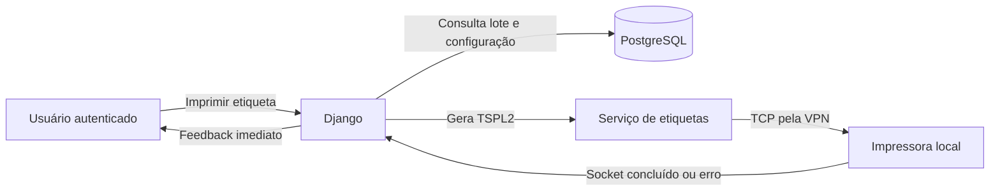

# Impressão direta de etiquetas e campos automáticos — Design

## 1. Contexto

O projeto de referência `rgnfarmasystem` possui geração de etiquetas Argox em
TSPL2 e duas arquiteturas de transporte: conexão TCP direta e agente Windows
com fila persistente. Para este projeto foi escolhida a conexão TCP direta,
pois o servidor Django acessará a rede local da impressora pela VPN.

Os formulários genéricos atuais também exibem campos que já são preenchidos no
servidor. Esses campos não devem aceitar digitação nem alteração manual.

## 2. Objetivos

- cadastrar uma única impressora de etiquetas ativa;
- imprimir etiquetas diretamente do Django por TCP através da VPN;
- imprimir somente produto, lote, validade e identificação do usuário;
- apresentar retorno imediato de sucesso ou falha;
- desabilitar, em todas as telas de recursos, os campos que o servidor já gera;
- manter o backend como única autoridade sobre valores automáticos.

## 3. Escopo

### Incluído

- configuração da impressora em **Integrações → Impressora de etiquetas**;
- host ou IP, porta, protocolo TSPL2, dimensões, estado e observações;
- garantia de no máximo uma configuração ativa;
- ação **Imprimir etiqueta** no detalhe de lote;
- geração determinística de TSPL2;
- comunicação TCP síncrona com timeout curto;
- identificação automática do usuário e data/hora na etiqueta;
- mensagens seguras para configuração ausente, dados inválidos e falhas de rede;
- registro explícito de campos gerados automaticamente;
- campos automáticos desabilitados no cadastro e na edição;
- campos automáticos somente leitura no Django Admin;
- testes automatizados, migration e documentação.

### Não incluído

- agente de impressão Windows;
- fila PostgreSQL, Celery ou RabbitMQ para impressão;
- histórico dedicado de trabalhos de impressão;
- reimpressão auditada ou justificativa de reimpressão;
- assinatura eletrônica com confirmação de senha;
- seleção entre várias impressoras;
- descoberta automática de equipamentos;
- código de barras;
- data de fabricação ou sublote na etiqueta;
- confirmação por sensor de que a etiqueta saiu fisicamente.

## 4. Decisões

### 4.1 Transporte

O Django abrirá uma conexão TCP com a impressora configurada e enviará o
comando TSPL2 diretamente. A conexão usará a rota disponibilizada pela VPN e a
porta cadastrada, cujo valor padrão será `9100`.

A operação será síncrona. O usuário aguardará o resultado da conexão durante a
requisição. Um envio concluído significa somente que os bytes foram entregues
ao socket; não comprova a saída física da etiqueta.

### 4.2 Configuração única

`LabelPrinterSettings` ficará no módulo `integrations` e armazenará:

- nome;
- host ou IP;
- porta;
- protocolo TSPL2;
- largura e altura em milímetros;
- estado ativo;
- observações;
- datas de criação e atualização herdadas do modelo-base.

Uma constraint condicional impedirá duas configurações ativas. A validação do
model e do formulário apresentará uma mensagem compreensível antes da falha de
banco. Configurações inativas poderão permanecer cadastradas para manutenção.

### 4.3 Conteúdo da etiqueta

A etiqueta conterá somente:

1. produto, combinando código e descrição quando ambos estiverem disponíveis;
2. lote;
3. validade no formato local `dd/mm/aaaa`;
4. assinatura operacional com nome completo do usuário autenticado e data/hora.

Na ausência de nome completo, a assinatura usará o username. A data/hora será
obtida no servidor e convertida para o timezone configurado pela aplicação.
Textos serão normalizados para ASCII, aspas serão sanitizadas e cada linha será
limitada para não produzir comandos TSPL2 inválidos.

Não haverá código de barras, data de fabricação nem sublote.

## 5. Arquitetura

As responsabilidades serão separadas:

- o model valida e persiste a configuração;
- uma função pura renderiza o TSPL2;
- uma função de transporte abre, envia e fecha o socket;
- o endpoint valida autenticação, permissão, lote e usuário;
- o JavaScript apenas solicita confirmação e apresenta o resultado.

Essa separação permite testar a etiqueta sem rede e testar o transporte sem
depender de uma impressora física.

## 6. Fluxo de impressão

1. o usuário abre o detalhe de um lote;
2. a interface exibe **Imprimir etiqueta** somente para usuário autorizado;
3. a confirmação informa que o envio será imediato;
4. o endpoint carrega o lote e a única configuração ativa;
5. o servidor valida produto, número do lote e validade;
6. o servidor resolve nome do usuário e horário local;
7. o serviço renderiza o TSPL2 conforme as dimensões configuradas;
8. o transporte conecta, envia todos os bytes e fecha o socket;
9. a API retorna sucesso ou erro normalizado;
10. a tela apresenta o resultado sem repetir automaticamente a requisição.

O endpoint usará POST, autenticação de sessão, CSRF e permissão de visualização
do lote. O navegador não poderá escolher host, porta nem payload.

## 7. Tratamento de erros

- lote, produto ou validade ausente: HTTP `400`;
- usuário não autenticado: comportamento padrão de autenticação da API;
- usuário sem permissão: HTTP `403`;
- impressora ativa ausente: HTTP `503`;
- timeout, VPN indisponível ou conexão recusada: HTTP `503`;
- erro inesperado: resposta genérica e log técnico no servidor.

Exceções de socket serão convertidas em mensagens operacionais. A resposta não
exporá traceback, credenciais, configuração interna da VPN nem dados técnicos
desnecessários. A conexão será fechada inclusive em caso de falha.

Não haverá repetição automática. O operador poderá solicitar nova impressão
manualmente após verificar o equipamento.

## 8. Campos gerados automaticamente

Será criado um registro central e explícito, sem inferência baseada apenas no
nome do campo. Ele abrangerá:

- `code` em models que usam `AutoCodeMixin` e possuem geração efetiva no
  servidor;
- identificadores operacionais preenchidos pelos métodos `save()`, incluindo
  requisições, cotações, pedidos, recebimentos, propostas, contratos,
  movimentos, auditorias, CAPAs e identificadores equivalentes;
- `batch_number` da ordem de produção, gerado pelo servidor quando vazio.

Campos manuais como número de endereço, documento fiscal, protocolo e códigos
de catálogos oficiais não serão desabilitados apenas por seu nome.

### 8.1 Cadastro

- o campo permanece visível;
- o widget fica desabilitado;
- o campo deixa de ser obrigatório para o formulário;
- o valor inicial é vazio;
- a ajuda informa **Gerado automaticamente pelo sistema ao salvar**;
- o campo é excluído da validação de model quando a geração ocorre no `save()`.

### 8.2 Edição

- o valor persistido permanece visível e desabilitado;
- a ajuda informa que o identificador é imutável;
- valores forjados no POST são ignorados pelo `ModelForm`;
- o backend não recalcula identificadores já persistidos.

### 8.3 Django Admin e APIs

O Django Admin aplicará os mesmos campos como somente leitura. APIs continuam
submetidas às regras dos models e serializers; esta entrega não transforma um
campo manual em automático nem altera formatos de sequência existentes.

## 9. Segurança e integridade

- host e porta são lidos somente da configuração persistida;
- o cliente não envia comandos TSPL2 arbitrários;
- o endpoint exige autenticação, CSRF e autorização;
- textos interpolados no TSPL2 são normalizados e sanitizados;
- o timeout limita requisições presas por falha de rede;
- não existe retry automático após conexão ou envio incerto;
- valores automáticos são gerados exclusivamente pelo servidor;
- constraints únicas existentes continuam protegendo identificadores;
- a constraint de impressora ativa protege contra seleção ambígua.

A identificação impressa é uma assinatura operacional visual. Ela não equivale
a assinatura eletrônica GxP, pois não exige reautenticação nem gera registro de
assinatura separado.

## 10. Testes

### Configuração

- criação de configuração válida;
- rejeição de host, porta ou dimensões inválidas;
- rejeição de segunda configuração ativa;
- exibição no registro e no formulário do módulo Integrações.

### Etiqueta e transporte

- TSPL2 determinístico com produto, lote, validade, usuário e data/hora;
- fallback do nome completo para username;
- normalização de acentos e aspas;
- ausência de código de barras, fabricação e sublote;
- validação de lote, validade e dimensões;
- uso do host e da porta cadastrados;
- envio integral em ASCII;
- fechamento do socket em sucesso e falha;
- conversão de timeout e erro de conexão em erro operacional.

### API e interface

- autenticação e permissão;
- método POST e proteção CSRF;
- respostas `400`, `403`, `503` e sucesso;
- botão somente no detalhe do lote autorizado;
- confirmação, estado de carregamento e mensagem final;
- ausência de retry automático no JavaScript.

### Campos automáticos

- cobertura do registro central contra os models esperados;
- campo desabilitado e opcional na criação;
- campo desabilitado e imutável na edição;
- exclusão correta da validação antes do `save()`;
- rejeição ou ignorância de valor forjado;
- campos manuais permanecem editáveis;
- Django Admin apresenta campos automáticos como somente leitura.

### Verificação geral

- migrations consistentes em PostgreSQL;
- `manage.py check` sem problemas;
- ausência de migrations pendentes;
- testes direcionados e suíte oficial completa aprovados;
- teste físico posterior com impressora conectada à rede local pela VPN.

## 11. Documentação

Serão atualizados o manual do usuário, a arquitetura de Integrações e o
procedimento operacional de configuração. A documentação informará que:

- o servidor precisa alcançar a impressora pela VPN;
- `9100` é apenas o padrão e pode ser configurado;
- sucesso do socket não confirma impressão física;
- não existe fila nem retry automático;
- a assinatura impressa não substitui assinatura eletrônica regulatória.

## 12. Critérios de aceitação

- apenas uma impressora pode estar ativa;
- a ação aparece no detalhe de lote para usuário autorizado;
- a etiqueta contém somente produto, lote, validade e assinatura operacional;
- não existe código de barras, fabricação ou sublote;
- nome e horário são definidos no servidor;
- o Django envia TSPL2 diretamente por TCP usando a configuração persistida;
- erros de dados, configuração, permissão e rede têm respostas distintas;
- nenhuma falha dispara repetição automática;
- todos os campos já gerados pelo servidor ficam visíveis e desabilitados;
- campos manuais continuam editáveis;
- models, APIs e Admin preservam a autoridade do backend;
- migrations, testes, documentação e menus são atualizados;
- a impressão física pela VPN é validada em ambiente com a impressora real.
