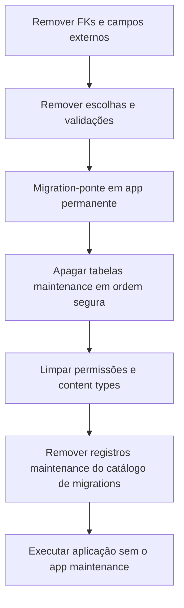

# Exclusão física de equipamentos e manutenção — Design

## 1. Contexto

O ERP ainda contém o app Django `maintenance`, responsável por equipamentos,
ativos críticos, planos, ordens, paradas, registros de uso e indicadores de
manutenção. A retirada funcional já iniciada remove rotas públicas, recursos da
interface e campos de equipamento espalhados por outros módulos, mas mantém o
app instalado e suas tabelas no banco.

Esta entrega conclui a exclusão física definitiva. Bases existentes devem ser
atualizadas por migrations, sem reset, e instalações novas devem construir um
schema válido sem depender do app removido.

## 2. Objetivos

- excluir fisicamente o pacote `maintenance` e todas as suas tabelas;
- remover referências funcionais a equipamento e manutenção dos demais apps;
- manter o grafo de migrations válido para bases existentes e bancos vazios;
- remover rotas, menus, permissões, content types, seeds, testes e documentação
  pertencentes ao módulo;
- preservar menções genéricas legítimas a equipamentos físicos que não
  representam o domínio excluído;
- entregar verificações automatizadas da ausência do módulo e de seus resíduos.

## 3. Escopo

### Incluído

- models, admin, serializers, views, URLs, migrations e configuração do app
  `maintenance`;
- tabelas com prefixo `maintenance_`;
- permissões e content types do app removido;
- campos, escolhas, validações e metadados funcionais `equipment` ou
  `maintenance` em Produção, Formulações, Qualidade, QA, Desvios, Mudanças,
  Treinamentos, Riscos, Planejamento, Compras, Integrações, Compliance e
  Governança;
- registros do módulo em menus, ações, estados, documentação funcional, seeds e
  testes;
- compatibilidade de migrations com bancos já existentes e bancos novos.

### Preservado

- menções históricas dentro de migrations antigas que não sejam dependências
  executáveis do app removido;
- referências genéricas a equipamento físico, como impressora de etiquetas ou
  dispositivo operacional, quando não representam cadastro ou relacionamento
  com o antigo módulo;
- textos regulatórios gerais sobre equipamentos quando necessários para BPF,
  validação ou instruções operacionais.

### Não incluído

- exportação ou arquivamento dos dados de manutenção antes da exclusão;
- substituição do módulo por outro cadastro de ativos;
- compatibilidade reversa com clientes que consumiam `/api/maintenance/`;
- migration reversível para recriar tabelas ou recuperar dados apagados.

## 4. Abordagem escolhida

A exclusão ocorrerá em uma única entrega por meio de uma migration-ponte em um
app permanente. Essa migration será executada somente depois das migrations que
removem relacionamentos externos com `maintenance`.

O histórico inicial de `training` será ajustado para não depender de
`maintenance.0001_initial` nem criar FKs para `EquipmentAsset`. Isso permite
que uma instalação nova monte o grafo sem carregar o app excluído. Em bases que
já aplicaram essa migration, o Django não a executará novamente; as migrations
incrementais já removem as FKs existentes.

A migration-ponte apagará as tabelas do antigo app em ordem de dependência,
usando introspecção e nomes de tabela explícitos. Ela também limpará permissões,
content types e registros do app em `django_migrations`. A operação será
deliberadamente irreversível.

Depois disso, `maintenance` sairá de `INSTALLED_APPS` e o diretório do app será
removido. Nenhuma migration ativa poderá depender dele.

## 5. Ordem da migração

A migration-ponte dependerá explicitamente das últimas migrations de todos os
apps que antes referenciavam equipamentos. Ela verificará a existência de cada
tabela antes de apagá-la, permitindo execução tanto em bases que receberam o
módulo quanto em bancos onde as tabelas não existem.

Não será usado `CASCADE` indiscriminado. A ordem explícita de exclusão e a
remoção prévia das FKs evitam apagar objetos fora do escopo.

## 6. Referências funcionais

Uma referência será removida quando permitir cadastrar, selecionar, vincular,
filtrar, bloquear, treinar, planejar, integrar ou classificar um equipamento ou
o módulo de manutenção. Isso inclui:

- escolhas `EQUIPMENT` em enums de domínio;
- origem `MAINTENANCE` em fluxos operacionais;
- campos `equipment`, `equipment_code` e `equipment_reference`;
- tipos de vínculo, recurso, alvo, treinamento, mudança e integração;
- módulos de compliance, governança e relatórios;
- campos de busca, formulários, listas, inlines, actions e filtros;
- seeds e dados demonstrativos que criem ativos ou planos de manutenção.

Menções puramente textuais serão avaliadas pelo contexto. Documentos de
impressão podem continuar dizendo “equipamento físico”, pois isso não reativa o
domínio removido.

### 6.1 Tratamento dos dados existentes

Valores legados não permanecerão gravados depois que suas choices forem
removidas. A migration de dados aplicará esta política:

- conectores de Integrações com `provider_type='equipment'` serão excluídos;
- recursos de Planejamento com `resource_type='equipment'` serão excluídos;
- vínculos de Riscos com `link_type='equipment'` serão excluídos, preservando os
  riscos relacionados;
- requisições de Compras com `source='maintenance'` serão convertidas para
  `source='manual'`, preservando o documento transacional e sua auditoria.

Essa limpeza ocorrerá antes das alterações de schema e da remoção das tabelas
de manutenção. A migration registrará as quantidades afetadas no log do
processo sem expor conteúdo sensível dos registros.

## 7. Segurança, integridade e tratamento de erros

- a operação de banco será atômica quando suportada pelo backend;
- tabelas serão identificadas por uma lista fixa, nunca por entrada externa;
- a migration falhará de forma explícita diante de dependências inesperadas;
- não haverá `DROP ... CASCADE` genérico;
- a exclusão será irreversível e isso ficará documentado na própria migration;
- referências regulatórias genéricas serão preservadas para não degradar
  instruções de validação ou operação;
- não serão criados fallbacks silenciosos para rotas ou valores antigos.

## 8. Testes e verificação

### Comportamento da aplicação

- `maintenance` não consta em `INSTALLED_APPS` nem no registro de módulos;
- URLs `/api/maintenance/`, `/api/v1/maintenance/` e `/app/maintenance/` não
  resolvem;
- nenhum model ativo possui campos de equipamento removidos;
- enums e choices ativos não oferecem `equipment` ou `maintenance` no contexto
  do módulo excluído;
- menus, registros de UI, ações, seeds e documentação funcional não expõem o
  módulo.

### Banco existente

- criar uma base no estado anterior à exclusão;
- inserir registros representativos nas tabelas de manutenção;
- aplicar as migrations novas;
- confirmar ausência de tabelas `maintenance_%`;
- confirmar ausência dos content types e permissões do app;
- confirmar que models restantes continuam íntegros.

### Banco vazio

- construir o banco integralmente a partir das migrations versionadas;
- confirmar que o grafo não possui dependência ausente;
- confirmar que nenhuma tabela `maintenance_%` é criada;
- executar `manage.py check`, `makemigrations --check --dry-run` e a suíte de
  testes relevante.

## 9. Critérios de aceitação

A remoção será considerada concluída somente quando:

1. o diretório `maintenance/` não existir;
2. o app não constar em configurações, rotas, menus ou imports;
3. nenhuma tabela `maintenance_%` existir após a migration;
4. permissões e content types do app tiverem sido removidos;
5. nenhum campo ou choice funcional de equipamento/manutenção permanecer;
6. migrations funcionarem em uma base existente e em uma base vazia;
7. documentação, seeds, menus e permissões estiverem coerentes;
8. verificações Django e testes relevantes passarem sem pendências conhecidas.

## 10. Risco aceito

Todos os dados do módulo de manutenção serão destruídos. Não haverá migration
reversa nem mecanismo de recuperação incluído nesta entrega. A solicitação de
exclusão física definitiva constitui autorização para essa perda de dados,
limitada às tabelas, metadados e referências funcionais descritos neste design.
